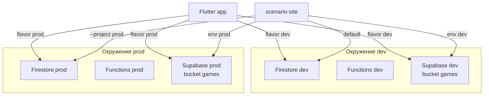

# Спецификация реализации — US-E0-02 «Окружения Firebase dev и production»

## 1. Scope

**В объёме:**

- Создание и настройка двух Firebase-проектов: dev = `scenario-ba26a`, prod = `scenario-prod-491c`.
- Два Supabase-проекта (dev и prod), создаются с нуля; Supabase Storage разделяется по окружениям (**ED-14**, **A-5**, **A-39**).
- Flutter: multi-env конфигурация (flavors dev/prod) + первичная интеграция Supabase SDK.
- scenario-site: `.firebaserc`, env-файлы, функции, первичная интеграция Supabase.
- Минимальный CI (проверка секретов + сборка dev).
- Документация mapping ветка/сборка → проект.

**Вне scope:**

- Скрипт импорта контента с параметром project id (follow-up, §7).
- Полный CI/CD всех каналов (по стори US-E0-02).

## 2. Требования → шаги

| # | Требование | Источник | Шаги |
|---|---|---|---|
| R1 | Два окружения Firebase, отдельные от прода | AC-01, A-43 | 1–2 |
| R2 | Секреты не в git; конфиг через env/secrets | AC-02, A-40 | 4–10 |
| R3 | Документация: ветка/сборка → проект | стори | 11 |
| R4 | Flutter собирается в dev и prod | AC-01 (TC-02) | 4–6 |
| R5 | scenario-site настроен на оба проекта | стори | 7 |
| R6 | Минимальный CI | scope (e) | 10 |
| R7 | dev-стенд `scenario-ba26a` используется как dev-окружение | решение | — |
| R8 | Supabase Storage разделён по окружениям | ED-14, A-5, A-39 | 3, 8 |
| R9 | Первичная интеграция Supabase в Flutter и сайт | решение команды | 4, 7, 8 |

## 3. Архитектура окружений



## 4. Шаги (в порядке зависимостей)

### Шаг 1. Создать Firebase-проекты

```bash
firebase projects:create scenario-dev --display-name "Scenario Dev"
firebase projects:create scenario-prod --display-name "Scenario Prod"
```

Проверка прав на создание — на этом шаге; при отсутствии роли Owner/Editor — блокер (§8).

### Шаг 2. Настроить сервисы Firebase в обоих проектах

- Firestore (режим, правила из `scenario-site/firestore.rules`, индексы из `firestore.indexes.json`).
- Functions (деплой `scenario-site/functions`).
- FCM + APNs (iOS), Analytics, Crashlytics.
- Регистрация Android (`com.scenario.scenario`) и iOS (`com.scenario.scenario`) приложений в каждом проекте.

**Статус 2026-08-31:**

- Приложения: dev — уже были (Android/iOS/Web); prod — созданы (Android `1:268811118114:android:1e280a0d804959fb4b8c7b`, iOS `1:268811118114:ios:ac89edeebea89d184b8c7b`, Web `1:268811118114:web:81f7ca40fea5bb2f4b8c7b`).
- Firestore: база (default) создана в обоих проектах (europe-west1); rules задеплоены (временные закрытые, ADR-011 — отдельно); indexes пустые.
- Cloud Functions API: dev — уже включён, prod — включён. Функций в коде пока нет (заглушка), деплой — в стори E1/E3.
- FCM API: включён в обоих. APNs: НЕТ (ключи Apple Developer отсутствуют) — отложено до стори push (E3).
- Analytics: включён пользователем в Firebase Console (оба проекта). Crashlytics: включён по умолчанию, интеграция SDK — в шагах 4–6 (Flutter).
- Cloud Scheduler: НЕ включён — требует billing account (ошибка `UREQ_PROJECT_BILLING_NOT_FOUND`). Решение: бесплатная альтернатива — GitHub Actions cron (см. раздел «Альтернатива Cloud Scheduler»).

### Шаг 3. Supabase-проекты (блокер: доступ)

**Статус 2026-08-31 (выполнено):**

- Оба проекта созданы ранее: dev `bzraqbhydmklvpfqiidl`, prod `sjxmmqnejolgtwcfjzsd` (Central EU Frankfurt).
- Бакет `games` создан в обоих проектах: public, file_size_limit 10MB, allowed_mime_types image/jpeg|png|webp.
- Storage policy `public_read_games` (SELECT для public) создана в обоих — публичное чтение объектов бакета games (A-39); запись — только service_role (политик insert/update/delete для anon нет).
- Ключи получены через Management API: anon + service_role (legacy JWT) для обоих проектов; также publishable/secret ключи нового формата.
- `scenario-site/.env.local` (вне git): NEXT_PUBLIC_SUPABASE_URL/ANON_KEY (dev), NEXT_PUBLIC_SUPABASE_URL_PROD/ANON_KEY_PROD (prod). Добавлены NEXT_PUBLIC_FIREBASE_* (dev) и NEXT_PUBLIC_FIREBASE_*_PROD (prod, из sdkconfig WEB 1:268811118114:web:81f7ca40fea5bb2f4b8c7b) — prod-сайт инициализирует Firebase. `.env.example` обновлён с секциями dev/prod.
- Доступ: Supabase CLI не работает в песочнице (EPERM на ~/.supabase/telemetry.json) — обход через HOME=/tmp/sb-home + SUPABASE_ACCESS_TOKEN из /tmp/supabase-token (PAT из Keychain). Management API: чтение проектов/ключей; создание бакетов — через Storage API проекта с service_role; политики — через SQL endpoint database/query.
- Примечание: service_role ключи хранятся в /tmp/sb_sr_dev.txt и /tmp/sb_sr_prod.txt (вне репозитория) — используются для импорта контента (follow-up).

### Шаг 4. Flutter: flavors + Firebase + Supabase

**Статус 2026-08-31 (выполнено):**

- `lib/firebase_options_dev.dart` — Firebase options dev (scenario-ba26a): android/ios.
- `lib/firebase_options_prod.dart` — Firebase options prod (scenario-prod-491c): android/ios (ключи из sdkconfig prod).
- `lib/app_config.dart` — выбор окружения по `--dart-define=APP_ENV=dev|prod` (default dev); firebaseOptions, supabaseUrl, supabaseAnonKey, projectId.
- `lib/supabase_config.dart` — `initSupabase()` (Supabase.initialize с publishableKey), `supabase` клиент, `supabasePublicUrl(path)` для публичных URL бакета games.
- `lib/main.dart` — инициализация Firebase (AppConfig.firebaseOptions) + Supabase (initSupabase) перед runApp; заголовок показывает окружение.
- `pubspec.yaml` — добавлен `supabase_flutter: ^2.17.2` (Dart >=3.9, Flutter >=3.35; проект SDK ^3.11.1 — совместимо).
- `flutter pub get` выполнен пользователем (49 зависимостей добавлено).
- Проверка: `dart analyze` — No issues found (после исправления unused import и deprecated anonKey → publishableKey).
- Сборка: `flutter run --dart-define=APP_ENV=dev --dart-define=SUPABASE_ANON_KEY_DEV=<key>` / `APP_ENV=prod` + `SUPABASE_ANON_KEY_PROD`.
- Примечание: песочница не может писать в Flutter SDK cache (EPERM) — `flutter pub get`/`flutter analyze` выполняются пользователем в терминале; `dart analyze` работает через прямой вызов dart-sdk.

### Шаг 5. Android

**Статус 2026-08-31 (выполнено):**

- `android/app/build.gradle.kts`: добавлены `flavorDimensions += "env"` и `productFlavors { create("dev") { applicationId "com.scenario.scenario.dev" } create("prod") { applicationId "com.scenario.scenario" } }` (Kotlin DSL, AGP 9 — create() вместо accessor'ов).
- Имя приложения per flavor: `src/dev/AndroidManifest.xml` (`android:label="Scenario Dev"`, tools:replace) и `src/prod/AndroidManifest.xml` (`android:label="Scenario"`).
- `android/app/src/dev/google-services.json` — конфиг dev (scenario-ba26a), содержит оба клиента (com.scenario.scenario + com.scenario.scenario.dev).
- `android/app/src/prod/google-services.json` — конфиг prod (scenario-prod-491c, app `1:268811118114:android:1e280a0d804959fb4b8c7b`), извлечён из `firebase apps:sdkconfig`.
- `.gitignore`: добавлены `android/app/google-services.json`, `android/app/src/**/google-services.json`, `ios/Runner/GoogleService-Info.plist` (A-40). Проверено `git status --ignored` — все конфиги игнорируются.
- Gradle 8.14 → **9.3.1**, AGP 8.11.1 → **9.1.0**, Kotlin 2.2.20 → **2.3.20** (совместимость с Java 25 из Android Studio JBR; Flutter 3.47.2 дефолт).
- Сборки: `flutter build apk --flavor dev` ✅ (app-dev-release.apk 44.8MB), `--flavor prod` ✅ (app-prod-release.apk 44.8MB).

### Шаг 6. iOS

**Статус 2026-08-31 (выполнено):**

- `ios/Runner/GoogleService-Info-Dev.plist` — конфиг dev (scenario-ba26a, app `1:602717699795:ios:368d1dd99f856220db9e26`), скопирован из текущего.
- `ios/Runner/GoogleService-Info-Prod.plist` — конфиг prod (scenario-prod-491c, app `1:268811118114:ios:ac89edeebea89d184b8c7b`), извлечён из `firebase apps:sdkconfig`.
- Build phase «Setup GoogleService-Info.plist» в `Runner.xcodeproj/project.pbxproj`: скрипт копирует `GoogleService-Info-Prod.plist` если `$FLAVOR=prod` или Release*, иначе `GoogleService-Info-Dev.plist` — в `Runner/GoogleService-Info.plist` перед сборкой.
- Xcode-схемы `dev.xcscheme` / `prod.xcscheme` созданы (копии Runner) — Flutter находит flavor.
- `.gitignore`: добавлены `ios/Runner/GoogleService-Info.plist`, `-Dev.plist`, `-Prod.plist` (A-40). Проверено `git status --ignored` — все три игнорируются.
- **CocoaPods удалён** (все плагины — Swift Packages): удалены Pods/, Podfile, Podfile.lock, .symlinks, Runner.xcworkspace; xcconfig и project.pbxproj очищены от Pods-ссылок.
- Сборки: `flutter build ios --simulator --flavor dev` ✅, `--flavor prod` ✅. На устройство — требует Apple Developer сертификаты (вне scope).

### Шаг 7. scenario-site

**Статус 2026-08-31 (выполнено):**

- `.firebaserc`: `{ "projects": { "default": "scenario-ba26a", "prod": "scenario-prod-491c" } }`.
- `package.json`: добавлен `@supabase/supabase-js ^2.45.0` (npm install выполнен).
- `src/lib/supabase.ts`: клиент Supabase (createClient) из env + `supabasePublicUrl(path)` для публичных URL бакета games.
- `functions/src/index.ts`: функция `dailyPush` (onRequest, defineString DAILY_PUSH_SECRET) — задел на будущее; деплой требует Blaze (Cloud Functions), отложен до E3.
- `scripts/daily-push.mjs`: скрипт ежедневного push без Cloud Functions (firebase-admin → Firestore + FCM), вызывается GitHub Actions cron (вариант C, A-7).
- `functions/.env` (вне git): `DAILY_PUSH_SECRET=<значение>` — для будущего деплоя dailyPush (Spark-совместимо, без Secret Manager).
- `functions/.gitignore`: добавлен `.env` (секреты вне git).
- `functions/tsconfig.json`: исправлен `module: NodeNext` (было commonjs + moduleResolution nodenext — ошибка TS5110).
- Удалён `functions/src/genkit-sample.ts` (шаблонный пример, мешал сборке).
- Проверка: `npm run build` (functions) — OK; `npx tsc --noEmit` (site) — OK. `next build` в песочнице падает с `kill EPERM` (ограничение песочницы, не код) — выполняется пользователем.
- Деплой функций: `firebase deploy --only functions --project scenario-ba26a` / `--project scenario-prod-491c` (секрет из functions/.env, деплоится вместе с функциями).

### Шаг 8. Supabase-интеграция в код

**Статус 2026-08-31 (выполнено):**

- Flutter: `Supabase.initialize` в `main.dart` (per env через AppConfig), `supabasePublicUrl(path)` в `supabase_config.dart` — уже готово с шага 4.
- Сайт: `src/lib/firebase.ts` — клиент Firebase (initializeApp + getFirestore) с выбором окружения `NEXT_PUBLIC_ENV` (dev/prod).
- Сайт: `src/lib/supabase.ts` — клиент Supabase + `supabasePublicUrl(path)` с выбором окружения `NEXT_PUBLIC_ENV`.
- Сайт: `src/components/SupabaseImage.tsx` — компонент `<SupabaseImage imageRef alt>` для отображения изображений из бакета games (строит публичный URL).
- Сайт: `src/app/scenarios/[id]/page.tsx` — клиентская страница сценария: читает `games/{id}` из Firestore, рендерит карусель через SupabaseImage.
- Проверка: `npx tsc --noEmit` — OK.
- Примечание: сайт SSG (output: export), Firestore читается на клиенте; `NEXT_PUBLIC_ENV=dev|prod` выбирает окружение (default dev).

### Шаг 9. Конфиги вне git

- `.gitignore`: `google-services.json`, `GoogleService-Info.plist`, `.env.local` (в site уже есть).

### Шаг 10. Минимальный CI (GitHub Actions)

**Статус 2026-08-31 (выполнено):**

- `scenario/.github/workflows/ci.yml`:
  - Job `secret-scan`: gitleaks (gitleaks-action@v2) — проверка секретов в коде (A-40).
  - Job `flutter-build`: checkout → setup Flutter 3.47.2 → setup Java 17 → pub get → запись `android/app/src/dev/google-services.json` из секрета `GOOGLE_SERVICES_JSON_DEV` → flutter analyze → `flutter build apk --flavor dev`.
- Требуемые GitHub Secrets: `GOOGLE_SERVICES_JSON_DEV` (JSON google-services dev).
- YAML проверен (ruby YAML.load_file — OK).
- Примечание: google-services.json в .gitignore — CI записывает его из секрета перед сборкой.

### Шаг 11. Документация

**Статус 2026-08-31 (выполнено):**

- [`scenario/docs/environments.md`](../environments.md) создан: таблица окружений (Firebase/Supabase/flavors), ветка → окружение, команды сборки/запуска Flutter, переменные сайта, Supabase-ключи, ежедневный push, CI, сводка секретов.

### Шаг 12. Вывод scenario-ba26a

**Статус 2026-08-31 (снят):** `scenario-ba26a` — это dev-стенд (не временный). Вывод из эксплуатации не требуется.

## 5. Файлы

| Файл | Действие | Зачем |
|---|---|---|
| `scenario/lib/firebase_options_dev.dart` / `_prod.dart` | создать | options dev/prod |
| `scenario/lib/app_config.dart` | создать | выбор окружения APP_ENV |
| `scenario/lib/supabase_config.dart` | создать | инициализация Supabase + URL хелпер |
| `scenario/lib/main.dart` | изменить | init Firebase + Supabase по flavor |
| `scenario/pubspec.yaml` | изменить | + `supabase_flutter` |
| `scenario/android/app/build.gradle.kts` | изменить | productFlavors (AGP 9) |
| `scenario/android/app/src/dev/google-services.json` | создать (вне git) | конфиг dev |
| `scenario/android/app/src/prod/google-services.json` | создать (вне git) | конфиг prod |
| `scenario/android/app/src/dev/AndroidManifest.xml` | создать | label "Scenario Dev" |
| `scenario/android/app/src/prod/AndroidManifest.xml` | создать | label "Scenario" |
| `scenario/android/gradle/wrapper/gradle-wrapper.properties` | изменить | Gradle 9.3.1 |
| `scenario/android/settings.gradle.kts` | изменить | AGP 9.1.0, Kotlin 2.3.20 |
| `scenario/ios/Runner/GoogleService-Info-Dev.plist` | создать (вне git) | конфиг dev |
| `scenario/ios/Runner/GoogleService-Info-Prod.plist` | создать (вне git) | конфиг prod |
| `scenario/ios/Runner.xcodeproj/project.pbxproj` | изменить | build phase Setup GoogleService-Info.plist; CocoaPods удалён |
| `scenario/ios/Runner.xcodeproj/xcshareddata/xcschemes/dev.xcscheme` | создать | схема dev |
| `scenario/ios/Runner.xcodeproj/xcshareddata/xcschemes/prod.xcscheme` | создать | схема prod |
| `scenario/.gitignore` | изменить | конфиги вне git |
| `scenario-site/.firebaserc` | изменить | оба проекта |
| `scenario-site/.env.example` | изменить | Firebase + Supabase dev/prod |
| `scenario-site/package.json` | изменить | + `@supabase/supabase-js` |
| `scenario-site/src/lib/supabase.ts` | создать | клиент Supabase + URL хелпер |
| `scenario-site/functions/src/index.ts` | изменить | + dailyPush (секрет DAILY_PUSH_SECRET) |
| `scenario-site/functions/tsconfig.json` | изменить | module NodeNext |
| `scenario-site/firebase.json` | изменить | + секция firestore (rules/indexes) |
| `scenario-site/firestore.rules` | изменить | временные закрытые правила |
| `scenario-site/.github/workflows/daily-push.yml` | создать | ежедневный запуск dailyPush (замена Cloud Scheduler) |
| `scenario-site/.env.local` | обновить (вне git) | реальные ключи Firebase + Supabase dev/prod |
| `scenario/docs/environments.md` | создать | mapping (R3) |

## 6. Риски

- **Права на создание Firebase-проектов** — не проверены; при отказе нужна роль Owner/Editor для `ezhik163@gmail.com` в GCP.
- **Supabase-доступ** — получен (PAT); бакеты и политики настроены; service_role ключи — вне репозитория (/tmp).
- **Supabase-интеграция в код** — новая зависимость; согласовать версии SDK и способ хранения URL изображений (пути vs полные URL).
- **iOS per-configuration plist** — решено build phase; сборка на устройство требует Apple Developer (вне scope).
- **APNs** — ключи Apple Developer отсутствуют; push (FCM+APNs) отложен до стори E3; в этой стори FCM API включён, APNs не настраивается.
- **scenario-ba26a** — если там есть данные/настройки, удаление потеряет их; предложение: заморозить, удалить позже.
- **firebase-tools update check failed** — некритично, не блокер.
- **Firestore rules закрыты (allow read/write: if false, ADR-011)** — сайт читает games/{id} на клиенте, до открытия правил любой документ вернёт «Missing or insufficient permissions». Ожидаемо; открытие — отдельный follow-up (ADR-011).
- **Песочница** — EPERM на ~/.config, ~/.supabase, Flutter cache, next build workers; обходы описаны в §11.

## 7. Follow-up (вне scope)

- Скрипт импорта в `tools/` с обязательным параметром `--project` и загрузкой в Supabase per env — отдельная задача.

## Альтернатива Cloud Scheduler (бесплатная)

- Требование A-7: ежедневный запуск push в 11:00 МСК (08:00 UTC).
- Cloud Scheduler требует billing — недоступен (нет billing account).
- Cloud Functions (деплой) тоже требуют Blaze — `cloudbuild.googleapis.com` не включается на Spark. Поэтому **вариант C: GitHub Actions cron + firebase-admin напрямую к Firestore/FCM** (без Cloud Functions).
- **Решение (реализовано 2026-08-31):**
  - `scenario-site/scripts/daily-push.mjs` — скрипт: инициализация firebase-admin (service account), чтение `games` из Firestore, выбор игры (первая; TODO(E3) — ротация), отправка FCM в топик `daily`.
  - `scenario-site/.github/workflows/daily-push.yml` — cron '0 8 * * *' + workflow_dispatch; job: checkout → setup-node → npm ci → запись service account из секрета → `node scripts/daily-push.mjs`.
  - `package.json`: добавлен `firebase-admin ^13.6.0` (devDependencies).
- Требуемые GitHub Secrets: `FIREBASE_SERVICE_ACCOUNT` (JSON service account; роли: чтение Firestore + отправка FCM). Опционально `FCM_TOPIC` (default 'daily').
- Бесплатно (GitHub Actions free tier 2000 мин/мес; один запуск в день — ничтожно мало).
- Ограничение: GitHub отключает cron для репозиториев без активности 60 дней.
- Запасной вариант: внешний cron-сервис (cron-job.org / easycron) с HTTP-вызовом.
- Примечание: функция `dailyPush` в `functions/src/index.ts` остаётся как задел на будущее (деплой возможен после апгрейда до Blaze, стори E3).

## 8. Доступы и блокеры

### Firebase

Firebase CLI авторизован (`ezhik163@gmail.com`). Осталось:

1. **Права на создание проектов.** Проверяется на шаге 1 командой `firebase projects:create`. При отказе: Google Cloud Console → IAM и администрирование → добавить `ezhik163@gmail.com` с ролью **Owner** (или **Editor** + права на Firebase).
2. **Service account keys для CI/импорта** (когда дойдём до CI): Firebase Console → ⚙️ Project settings → **Service accounts** → **Generate new private key** — для `scenario-ba26a` и `scenario-prod-491c`. Файлы хранить вне репозитория.
3. **GitHub Secrets** (если CI в GitHub): Settings → Secrets and variables → Actions → `FIREBASE_TOKEN`, `GOOGLE_SERVICES_JSON`, `GOOGLE_SERVICE_INFO_PLIST`.

### Supabase

**Вариант A — Supabase CLI (рекомендуется):**

```bash
brew install supabase/tap/supabase
supabase login
supabase projects create scenario-dev --db-password '<надёжный пароль>'
supabase projects create scenario-prod --db-password '<надёжный пароль>'
supabase projects list   # dev bzraqbhydmklvpfqiidl, prod sjxmmqnejolgtwcfjzsd
```

**Вариант B — Dashboard (без CLI):**

1. Зарегистрироваться на [app.supabase.com](https://app.supabase.com) (тем же Google-аккаунтом или любым).
2. New project → `scenario-dev` → регион (например `eu-central-1`) → пароль БД.
3. Повторить для `scenario-prod`.
4. Project Settings → API: скопировать **Project URL**, **anon public key**, **service_role key** (service_role — секрет, не в git).

**Что передать агенту после создания:**

- `SUPABASE_URL_DEV`, `SUPABASE_ANON_KEY_DEV`, `SUPABASE_SERVICE_ROLE_KEY_DEV`
- `SUPABASE_URL_PROD`, `SUPABASE_ANON_KEY_PROD`, `SUPABASE_SERVICE_ROLE_KEY_PROD`

Ключи — в `.env.local` (вне git) или CI secrets; не публиковать в чате.

## 9. Verify

- `firebase projects:list` → 2 проекта; Supabase Dashboard → 2 проекта.
- `flutter build apk --flavor dev` и `--flavor prod` — успешно.
- `flutter run --flavor dev` → в Firebase DebugView виден `scenario-ba26a`; изображения грузятся из Supabase dev bucket.
- Сайт в dev-режиме читает медиа из dev bucket.
- CI workflow проходит; `gitleaks` по истории — 0 совпадений.
- `git grep -l "scenario-ba26a"` → только в конфигах/доке (это dev-стенд).

## 10. История изменений

| Версия | Дата | Изменения |
|--------|------|-----------|
| 1.0 | 2026-08-31 | Первый выпуск: окружения Firebase dev/prod, Supabase Storage per env, flavors, CI, документация |
| 1.3 | 2026-08-31 | Шаг 2: приложения в prod созданы, Firestore+rules в обоих, Functions/FCM API включены, Analytics включён, Crashlytics по умолчанию; Cloud Scheduler недоступен (нет billing) — выбрана бесплатная альтернатива GitHub Actions cron; APNs отложен до E3 |
| 1.4 | 2026-08-31 | Реализована замена Cloud Scheduler: GitHub Actions workflow daily-push.yml (cron 0 8 * * *, вызов dailyPush через секреты) |
| 1.5 | 2026-08-31 | Шаг 3 выполнен: бакеты games + policy public_read_games в обоих Supabase-проектах; ключи в .env.local (вне git); .env.example обновлён |
| 1.6 | 2026-08-31 | Шаг 4 выполнен: firebase_options dev/prod, app_config (APP_ENV), supabase_config, main.dart, supabase_flutter 2.17.2; dart analyze — чисто |
| 1.7 | 2026-08-31 | Шаг 5 выполнен: Android flavors dev/prod (applicationId, app_name), google-services.json per flavor (вне git), .gitignore обновлён; Gradle 9.3.1/AGP 9.1.0/Kotlin 2.3.20; сборки dev+prod прошли |
| 1.8 | 2026-08-31 | Шаг 6 выполнен: GoogleService-Info-Dev/Prod.plist (вне git), build phase подстановки по конфигурации, схемы dev/prod, .gitignore обновлён; CocoaPods удалён; симулятор собрался |
| 1.9 | 2026-08-31 | Промежуточный документ: команды, секреты, последовательность, статус шагов |
| 1.10 | 2026-08-31 | Шаг 7 выполнен: .firebaserc (оба проекта), @supabase/supabase-js, src/lib/supabase.ts, функция dailyPush (секрет DAILY_PUSH_SECRET), tsconfig NodeNext, genkit-sample удалён |
| 1.11 | 2026-08-31 | Шаг 8 выполнен: сайт — firebase.ts, supabase.ts (NEXT_PUBLIC_ENV), SupabaseImage, страница сценария читает Firestore и рендерит карусель; tsc — чисто |
| 1.12 | 2026-08-31 | dailyPush переведён с defineSecret (Secret Manager, Blaze-only) на defineString + functions/.env (Spark-совместимо); .gitignore функций покрывает .env |
| 1.13 | 2026-08-31 | Cloud Functions требуют Blaze (cloudbuild не включается на Spark) — выбран вариант C: GitHub Actions cron + firebase-admin (scripts/daily-push.mjs) напрямую к Firestore/FCM; dailyPush в functions — задел на E3 |
| 1.14 | 2026-08-31 | Шаг 10 выполнен: scenario/.github/workflows/ci.yml — gitleaks + flutter build apk dev (google-services из секрета GOOGLE_SERVICES_JSON_DEV); YAML валиден |
| 1.15 | 2026-08-31 | Шаг 11 выполнен: docs/environments.md (mapping ветка/сборка → проект, команды, секреты); шаг 12 снят — scenario-ba26a это dev-стенд |
| 1.16 | 2026-08-31 | P1 устранён: .env.local дополнен NEXT_PUBLIC_FIREBASE_*_PROD (из sdkconfig prod) — prod-сайт теперь инициализирует Firebase |
| 1.17 | 2026-08-31 | P2-1..P3-3 устранены: удалён легаси lib/firebase_options.dart; firebase.json (flutterfire) переведён на per-flavor dev/prod; git rm firebase-admin.ts; firebase-admin → dependencies; run_ios_simulator.sh принимает dev/prod; спека приведена к фактическим окружениям (dev=scenario-ba26a) |

## 11. Промежуточный результат (2026-08-31)

### 11.1 Команды (что запускать, для чего, в каком порядке)

**Порядок выполнения (шаги стори):**

1. **Firebase: деплой Firestore rules** (шаг 2) — закрытые временные правила в оба проекта:
   ```bash
   export XDG_CONFIG_HOME=/tmp/fb-config   # обход EPERM песочницы (configstore)
   cd scenario-site
   firebase deploy --only firestore:rules --project scenario-ba26a        # dev
   firebase deploy --only firestore:rules --project scenario-prod-491c    # prod
   ```

2. **Supabase: бакеты и политики** (шаг 3) — уже выполнено; повторно не требуется. Для проверки:
   ```bash
   export SUPABASE_ACCESS_TOKEN=$(cat /tmp/supabase-token)
   supabase projects list   # оба проекта видны
   ```

3. **Flutter: установка зависимостей** (шаг 4):
   ```bash
   cd scenario
   flutter pub get
   ```

4. **Flutter: статический анализ** (шаг 4):
   ```bash
   dart analyze   # или flutter analyze (вне песочницы)
   ```

5. **Android сборки** (шаг 5):
   ```bash
   flutter build apk --flavor dev
   flutter build apk --flavor prod
   ```

6. **iOS сборки** (шаг 6) — симулятор (без подписи):
   ```bash
   flutter build ios --simulator --flavor dev
   flutter build ios --simulator --flavor prod
   ```
   На устройство — требует Apple Developer сертификаты (вне scope).

7. **Запуск dev** (шаг 4):
   ```bash
   flutter run --dart-define=APP_ENV=dev --dart-define=SUPABASE_ANON_KEY_DEV="$(cat /tmp/sb_anon_dev.txt)"
   ```

### 11.2 Секреты и где они лежат

| Секрет | Путь | Назначение | В git? |
|---|---|---|---|
| Supabase PAT (Management API) | `/tmp/supabase-token` | Управление проектами/ключами | нет |
| Supabase service_role dev | `/tmp/sb_sr_dev.txt` | Запись в Storage (импорт контента) | нет |
| Supabase service_role prod | `/tmp/sb_sr_prod.txt` | Запись в Storage (импорт контента) | нет |
| Supabase anon dev | `/tmp/sb_anon_dev.txt`, `scenario-site/.env.local` | Публичный ключ клиента | нет (.env.local в .gitignore) |
| Supabase anon prod | `/tmp/sb_anon_prod.txt`, `scenario-site/.env.local` | Публичный ключ клиента | нет |
| Firebase token (CLI) | `/tmp/fb-config/configstore/firebase-tools.json` | Деплой rules/приложений | нет |
| Firebase Android dev | `scenario/android/app/src/dev/google-services.json` | Конфиг клиента dev | нет (.gitignore) |
| Firebase Android prod | `scenario/android/app/src/prod/google-services.json` | Конфиг клиента prod | нет (.gitignore) |
| Firebase iOS dev | `scenario/ios/Runner/GoogleService-Info-Dev.plist` | Конфиг клиента dev | нет (.gitignore) |
| Firebase iOS prod | `scenario/ios/Runner/GoogleService-Info-Prod.plist` | Конфиг клиента prod | нет (.gitignore) |
| Firebase options (код) | `scenario/lib/firebase_options_dev.dart`, `_prod.dart` | Публичные ключи (API key) | да (публичные по дизайну) |

### 11.3 Статус шагов

| Шаг | Статус | Примечание |
|---|---|---|
| 1. Firebase-проекты | ✅ | dev `scenario-ba26a`, prod `scenario-prod-491c` |
| 2. Сервисы Firebase | ✅ | Firestore+rules, Functions/FCM API, Analytics, Crashlytics; APNs — E3 |
| 3. Supabase Storage | ✅ | Бакет games + policy public_read_games в обоих |
| 4. Flutter flavors | ✅ | firebase_options dev/prod, app_config, supabase_config, main.dart |
| 5. Android | ✅ | flavors dev/prod, google-services per flavor; сборки прошли |
| 6. iOS | ✅ | схемы dev/prod, GoogleService-Info per config; симулятор собрался; CocoaPods удалён |
| 7. scenario-site | ✅ | .firebaserc, supabase-js, src/lib/supabase.ts, dailyPush |
| 8. Supabase-интеграция | ✅ | firebase.ts, supabase.ts (NEXT_PUBLIC_ENV), SupabaseImage, страница сценария |
| 9. Конфиги вне git | ✅ | .gitignore покрывает все секреты |
| 10. CI | ✅ | ci.yml: gitleaks + flutter build apk dev |
| 11. Документация | ✅ | docs/environments.md создан |
| 12. Вывод scenario-ba26a | ➖ снят | scenario-ba26a — dev-стенд |

### 11.4 Известные ограничения

- Песочница не может писать в `~/.config` (EPERM) — обход: `XDG_CONFIG_HOME=/tmp/fb-config` для Firebase CLI, `HOME=/tmp/sb-home` для Supabase CLI.
- Песочница не может писать в Flutter SDK cache — `flutter pub get`/`flutter build` выполняются в терминале пользователя.
- Песочница не может убивать воркеры Next.js — `next build` выполняется в терминале пользователя (`kill EPERM`).
- APNs (iOS push) — нет ключей Apple Developer, отложено до стори E3.
- Cloud Scheduler — требует billing, заменён GitHub Actions cron (daily-push.yml).
- CocoaPods удалён (все плагины — Swift Packages); сборка iOS быстрее.