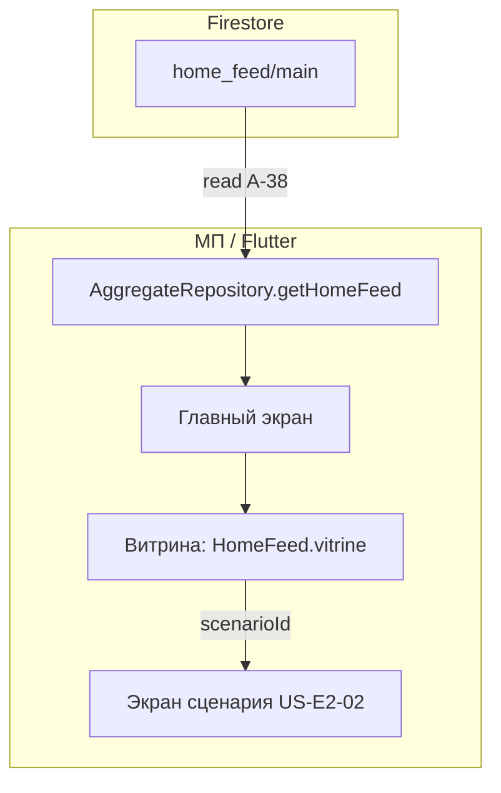

# Спецификация реализации — US-E2-01 «Главный экран: витрина сценариев»

## 1. Scope

**В объёме:**

* **Главный экран** в МП: витрина сценариев из `home_feed/main` (**FR-M-1**, **A-12**, **AC-01**).

* **Элементы витрины**: название и опциональный подзаголовок из данных (**AC-02**); при наличии `imageRef` — превью (**A-39**).

* **Порядок и состав** сценариев — как на сервере (`HomeFeed.vitrine`) (**FR-M-1**, **AC-01**).

* **Переход** на экран сценария по тапу (**US-E2-02**, **UC-01**).

* **Чтение данных** через `AggregateRepository.getHomeFeed()` из `home_feed/main` (**A-11**, **A-38**).

* **Тесты**: widget-тесты экрана (AC-01, AC-02).

**Вне scope:**

* Группы смысла — **US-E7-01** (здесь `HomeFeed.groups` не рендерится).

* Push-реактивация — **US-E3-04**.

* Аналитика открытий сценария — **US-E6-02** (отдельная стори).

* Экран сценария — **US-E2-02** (реализован; здесь только переход на него).

## 2. Требования → шаги

| #  | Требование                                                      | Источник          | Шаги |
| -- | --------------------------------------------------------------- | ----------------- | ---- |
| R1 | Витрина сценариев в порядке и составе с сервера                 | AC-01, FR-M-1     | 2    |
| R2 | Название и опциональный подзаголовок из данных                  | AC-02             | 2    |
| R3 | Превью при наличии `imageRef`                                   | A-39              | 2    |
| R4 | Чтение `home_feed/main` через репозиторий                       | A-11, A-38        | 1    |
| R5 | Переход на экран сценария с `scenarioId`                        | US-E2-02, UC-01   | 3    |

## 3. Архитектура данных

**Ключевые решения:**

* **Источник — `home_feed/main`** (**A-11**, **A-38**): главный экран читает публичный агрегат через `AggregateRepository.getHomeFeed`; черновики недоступны клиенту.

* **Витрина — `HomeFeed.vitrine`** (**FR-M-1**): `List<ScenarioCard>` в порядке и составе с сервера (**AC-01**). Группы смысла (`groups`) не рендерятся (вне scope, US-E7-01).

* **Элемент витрины** (**AC-02**): `ScenarioCard` — `title`, опциональный `subtitle`; при наличии `imageRef` — превью через `supabasePublicUrl(imageRef)` (**A-39**).

* **Переход на сценарий** (**US-E2-02**, **UC-01**): тап по карточке открывает `ScenarioScreen` с `scenarioId`.

## 4. Шаги (в порядке зависимостей)

### Шаг 1. Чтение данных через репозиторий

* `AggregateRepository.getHomeFeed()` уже реализован (`FirestoreAggregateRepository`, SP-E0-01). Экран получает `HomeFeed` из `home_feed/main`.

* **Реализовано:** `scenario/lib/features/home/home_screen.dart` — `HomeScreen` (StatefulWidget), читает `home_feed/main` через инжектируемый `AggregateRepository`.

### Шаг 2. Витрина сценариев (AC-01, AC-02)

* Рендер `HomeFeed.vitrine` (`List<ScenarioCard>`) в порядке из данных (**FR-M-1**).

* Каждая карточка: `title`, при наличии `subtitle` — подзаголовок (**AC-02**); при наличии `imageRef` — превью через `supabasePublicUrl(imageRef)` (**A-39**).

* **Реализовано:** `_HomeContent` (ListView) + `_ScenarioCardTile` (ListTile) с превью и подзаголовком; заглушка при пустой витрине.

### Шаг 3. Переход на экран сценария (R5)

* Тап по карточке → `ScenarioScreen(scenarioId)` (**US-E2-02**).

* Переход — через инжектируемый колбэк `onOpenScenario(scenarioId)` для тестируемости.

* **Реализовано:** `onOpenScenario` в `_ScenarioCardTile`.

### Шаг 4. Тесты

| AC    | Слой  | Проверка                                             | Где                          |
| ----- | ----- | ---------------------------------------------------- | ---------------------------- |
| AC-01 | widget | Витрина в порядке и составе с сервера                | widget-тест экрана           |
| AC-02 | widget | Название и опциональный подзаголовок из данных       | widget-тест экрана           |

* Widget-тесты с фейковым `AggregateRepository` (по образцу `test/scenario_screen_test.dart`).

* **Реализовано:** `scenario/test/home_screen_test.dart` — 3 теста (AC-01, AC-02, пустая витрина).

## 5. Файлы

* `docs/product/specs/e2-home-scenario-showcase.md` — **настоящий документ** (SP-E2-01).

* `scenario/lib/features/home/home_screen.dart` — главный экран (реализовано).

* `scenario/lib/data/contract/models.dart` — `HomeFeed`, `ScenarioCard` (существуют, контракт не меняется).

* `scenario/lib/data/firestore/aggregate_repository.dart` — `getHomeFeed` (существует).

* `scenario/lib/features/scenario/scenario_screen.dart` — `ScenarioScreen` (существует, US-E2-02).

* `scenario/test/home_screen_test.dart` — widget-тесты экрана (реализовано).

## 6. Риски

* **Навигация на сценарий** — зависит от готовности `ScenarioScreen` (**US-E2-02**, реализован). Митиг: переход через `onOpenScenario(scenarioId)`.

* **Отсутствие `imageRef`** у карточки — превью не показывается, остаётся заглушка. Митиг: опциональное поле, рендер без изображения.

* **Пустая витрина** — показывается состояние «нет сценариев». Митиг: заглушка при пустом `vitrine`.

## 7. Follow-up (вне scope)

* Группы смысла — **US-E7-01**.

* Аналитика открытий сценария — **US-E6-02**.

* Офлайн-доступ — **US-E2-05**; обновление контента — **US-E2-04**.

## 8. Доступы и блокеры

* **E0/E1**: `home_feed` и опубликованные сценарии (зависимость данных).

* **A-40**: секреты — только env/Secret Manager, не в git.

## 9. Verify

Соответствие критериям приёмки **US-E2-01**:

* **AC-01 (FR-M-1)** — витрина отображает сценарии в порядке и составе с сервера (widget-тест).

* **AC-02** — у каждого элемента видны название и опциональный подзаголовок из данных (widget-тест).

Критерий готовности: главный экран рендерит витрину из `home_feed`; widget-тесты AC-01..AC-02 зелёные.

## 10. История изменений

| Дата       | Автор | Изменение                                                                                                                          |
| ---------- | ----- | ---------------------------------------------------------------------------------------------------------------------------------- |
| 2026-09-07 | AID   | Первая версия (drafted). Главный экран из `home_feed/main` (A-11/A-38): витрина сценариев (FR-M-1), название/подзаголовок (AC-02), переход на экран сценария (US-E2-02). |
| 2026-09-07 | AID   | Реализован главный экран (`lib/features/home/home_screen.dart`): витрина, название/подзаголовок, переход на сценарий; widget-тесты AC-01..AC-02 + пустая витрина (`test/home_screen_test.dart`). |