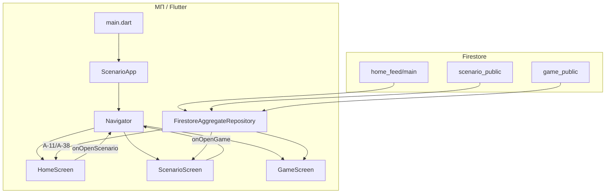

# Спецификация реализации — US-E2-07 «Склейка МП: точка входа и навигация»

## 1. Scope

**В объёме:**

* **Точка входа приложения**: подключение главного экрана (витрины) как `home` в `MaterialApp` (**AC-01**, **A-15**).

* **Навигация Home → Scenario → Game** через `Navigator` (**AC-02**, **A-15**).

* **Связывание колбэков** экранов (`onOpenScenario`/`onOpenGame`) с переходами.

* **Инициализация реального репозитория** (`FirestoreAggregateRepository` с `FirebaseFirestore.instance`, **A-11**, **A-38**).

* **Тесты**: smoke-тест точки входа.

**Вне scope:**

* Онбординг первого запуска — **US-E3-01** (реализован отдельно).

* Офлайн/кэш/обновление — **US-E2-04/05/06** (реализованы).

* Push/deep link — **E3**.

## 2. Требования → шаги

| #  | Требование                                                          | Источник          | Шаги |
| -- | ------------------------------------------------------------------- | ----------------- | ---- |
| R1 | Главный экран — точка входа (витрина из `home_feed/main`)           | AC-01, A-15, A-11 | 1    |
| R2 | Навигация Home → Scenario → Game через Navigator                    | AC-02, A-15       | 2    |
| R3 | Колбэки экранов связаны с переходами                                | AC-02, A-15       | 2    |
| R4 | Реальный репозиторий Firestore                                      | A-11, A-38        | 1    |

## 3. Архитектура данных

**Ключевые решения:**

* **Точка входа — `ScenarioApp`** (**A-15**): `main.dart` запускает `ScenarioApp`, который создаёт `MaterialApp` с `home: HomeScreen`.

* **Навигация через `Navigator`** (**A-15**): колбэки `onOpenScenario`/`onOpenGame` вызывают `Navigator.push` с `MaterialPageRoute` на экраны сценария/игры.

* **Реальный репозиторий** (**A-11**, **A-38**): `FirestoreAggregateRepository(FirebaseFirestore.instance)` читает только публичные агрегаты.

## 4. Шаги (в порядке зависимостей)

### Шаг 1. Точка входа и репозиторий

* `main.dart` инициализирует Firebase/Supabase/persistence и запускает `ScenarioApp`.

* `ScenarioApp` создаёт `FirestoreAggregateRepository(FirebaseFirestore.instance)` и `MaterialApp(home: HomeScreen)`.

* **Реализовано:** `lib/app.dart` (`ScenarioApp`), `lib/main.dart`.

### Шаг 2. Навигация

* `HomeScreen.onOpenScenario` → `Navigator.push(ScenarioScreen)`.

* `ScenarioScreen.onOpenGame` → `Navigator.push(GameScreen)`.

* **Реализовано:** маршруты `_HomeRoute`/`_ScenarioRoute`/`_GameRoute` в `lib/app.dart`.

### Шаг 3. Тесты

| AC    | Слой  | Проверка                                             | Где                          |
| ----- | ----- | ---------------------------------------------------- | ---------------------------- |
| AC-01 | widget | Точка входа — витрина из `home_feed/main`            | smoke-тест `ScenarioApp`     |
| AC-02 | widget | Переходы Home → Scenario → Game                      | smoke-тест + экранные тесты  |

* Smoke-тест `ScenarioApp` (с фейковым репозиторием) проверяет рендер точки входа.

* **Реализовано:** `test/widget_test.dart` (smoke-тест `ScenarioApp`); переходы покрыты в `home/scenario/game_screen_test.dart`.

## 5. Файлы

* `docs/product/specs/e2-mp-entry-navigation.md` — **настоящий документ** (SP-E2-07).

* `scenario/lib/app.dart` — точка входа и навигация (реализовано).

* `scenario/lib/main.dart` — запуск `ScenarioApp` (реализовано).

* `scenario/lib/data/firestore/aggregate_repository.dart` — реальный репозиторий (существует).

* `scenario/test/widget_test.dart` — smoke-тест (реализовано).

## 6. Риски

* **Экраны не связаны** — навигация не работает. Митиг: колбэки через `Navigator.push` (реализовано).

* **Firestore не инициализирован** — точка входа падает. Митиг: `main.dart` инициализирует Firebase до `ScenarioApp`.

## 7. Follow-up (вне scope)

* Онбординг — **US-E3-01** (реализован).

* Push/deep link — **E3**.

## 8. Доступы и блокеры

* Экраны **US-E2-01/02/03** (реализованы).

* **A-40**: секреты — только env/Secret Manager, не в git.

## 9. Verify

Соответствие критериям приёмки **US-E2-07**:

* **AC-01 (A-15)** — при запуске видна витрина из `home_feed/main` (smoke-тест).

* **AC-02 (A-15, FR-M-2)** — переходы на экраны сценария и игры работают (smoke + экранные тесты).

Критерий готовности: `ScenarioApp` запускается, показывает витрину, переходы Home → Scenario → Game работают; smoke-тест зелёный.

## 10. История изменений

| Дата       | Автор | Изменение                                                                                                                          |
| ---------- | ----- | ---------------------------------------------------------------------------------------------------------------------------------- |
| 2026-09-07 | AID   | Первая версия (drafted). Склейка МП: точка входа, навигация через Navigator, реальный репозиторий. Реализовано в `app.dart`/`main.dart`. |