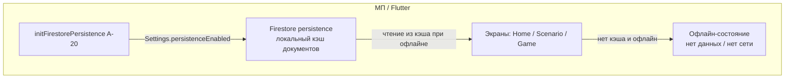

# Спецификация реализации — US-E2-05 «Офлайн: открытие ранее загруженного контента»

## 1. Scope

**В объёме:**

* **Firestore persistence** на мобильных клиентах для кэширования прочитанных документов (**A-20**).

* **Офлайн-доступ** к ранее загруженным витрине/сценарию/игре без блокирующей ошибки (**AC-01**, **FR-M-3**, **UC-07**, **NFR-SR-3**).

* **Пустое состояние «нет данных / нет сети»** при первом запуске офлайн с пустым кэшем (**AC-02**).

* **Изображения** — дисковый кэш (**US-E2-06**, **A-21a**); офлайн-показ кэшированных изображений.

* **Тесты**: widget-тесты офлайн-состояния экранов (AC-01, AC-02).

**Вне scope:**

* Полный offline-first для контента, никогда не открывавшегося онлайн (ожидаемо ограничено первым запуском).

* Обновление контента при сети — **US-E2-04** (здесь только чтение из кэша).

* Настройка дискового кэша изображений — **US-E2-06** (реализована).

## 2. Требования → шаги

| #  | Требование                                                          | Источник                | Шаги |
| -- | ------------------------------------------------------------------- | ----------------------- | ---- |
| R1 | Firestore persistence включён                                       | A-20, NFR-SR-3          | 1    |
| R2 | Офлайн с кэшем — показ данных без блокирующей ошибки                | AC-01, FR-M-3, UC-07    | 2    |
| R3 | Первый запуск офлайн — понятное состояние «нет данных / нет сети»   | AC-02                   | 2    |
| R4 | Изображения из дискового кэша при офлайне                           | A-21a, US-E2-06         | 2    |

## 3. Архитектура данных

**Ключевые решения:**

* **Persistence включён** (**A-20**): `FirebaseFirestore.instance.settings = Settings(persistenceEnabled: true)` до первого чтения. Firestore кэширует прочитанные документы на диске.

* **Офлайн с кэшем — рендер данных** (**AC-01**, **UC-07**): экраны отображают данные из кэша без блокирующей ошибки. Уже реализовано: экраны при `null` показывают спиннер/состояние, а не фатальную ошибку.

* **Офлайн без кэша — «нет сети»** (**AC-02**): при `isOffline` и отсутствии данных экран показывает понятное состояние «Нет сети. Проверьте подключение.» вместо бесконечного спиннера.

* **Изображения** (**A-21a**, **US-E2-06**): кэшированные изображения отображаются из дискового кэша при офлайне.

## 4. Шаги (в порядке зависимостей)

### Шаг 1. Включить Firestore persistence (A-20)

* В инициализации приложения (после `Firebase.initializeApp`): `FirebaseFirestore.instance.settings = Settings(persistenceEnabled: true)`.

* Это обязательная зависимость для офлайн-чтения (NFR-SR-3) и фонового обновления (US-E2-04).

* **Реализовано:** `scenario/lib/firestore_config.dart` — `enableFirestorePersistence()`; вызывается в `main.dart` после `Firebase.initializeApp`.

### Шаг 2. Офлайн-состояние экранов (AC-01, AC-02)

* Добавить флаг `isOffline` в экраны Home/Scenario/Game (по умолчанию `false`).

* При `isOffline == true` и `data == null` — показать состояние «Нет сети. Проверьте подключение.» (**AC-02**).

* При `isOffline == true` и `data != null` — рендер данных из кэша без ошибки (**AC-01**).

* Изображения — через `CachedNetworkImageWidget` (**US-E2-06**), который читает из дискового кэша при офлайне.

* **Реализовано:** флаг `isOffline` добавлен в `home_screen.dart`, `scenario_screen.dart`, `game_screen.dart`; при офлайне без кэша — состояние «Нет сети. Проверьте подключение.»

### Шаг 3. Тесты

| AC    | Слой  | Проверка                                             | Где                          |
| ----- | ----- | ---------------------------------------------------- | ---------------------------- |
| AC-01 | widget | Офлайн с кэшем — данные рендерятся без ошибки        | widget-тест экрана           |
| AC-02 | widget | Первый запуск офлайн — состояние «нет сети»          | widget-тест экрана           |

* Widget-тесты: фейковый `AggregateRepository` + `isOffline: true`; проверка рендера данных (AC-01) и состояния «нет сети» (AC-02).

* **Реализовано:** по 2 теста в `test/home_screen_test.dart`, `test/scenario_screen_test.dart`, `test/game_screen_test.dart` (AC-01, AC-02 офлайн).

## 5. Файлы

* `docs/product/specs/e2-offline-cached-content.md` — **настоящий документ** (SP-E2-05).

* `scenario/lib/firestore_config.dart` — включение persistence (реализовано, A-20).

* `scenario/lib/features/home/home_screen.dart`, `scenario/lib/features/scenario/scenario_screen.dart`, `scenario/lib/features/game/game_screen.dart` — экраны с флагом `isOffline` (реализовано).

* `scenario/lib/cache/cached_network_image_widget.dart` — кэш изображений (существует, US-E2-06).

* `scenario/test/home_screen_test.dart`, `scenario/test/scenario_screen_test.dart`, `scenario/test/game_screen_test.dart` — widget-тесты офлайн (реализовано).

## 6. Риски

* **Persistence не включён** — офлайн-чтение невозможно. Митиг: шаг 1 включает `Settings(persistenceEnabled: true)` до первого чтения.

* **Копирайт «нет сети»** — открытый вопрос стори (продукт/дизайн). Митиг: использовать нейтральную формулировку «Нет сети. Проверьте подключение.»; уточнить в дизайне.

* **Офлайн без кэша** — контент недоступен (первый запуск). Митиг: понятное состояние «нет сети» (AC-02), без противоречия FR-M-3.

## 7. Follow-up (вне scope)

* Обновление контента при сети — **US-E2-04**.

* Дисковый кэш изображений — **US-E2-06** (реализован).

* Аналитика синхронизации — **US-E6-01** при необходимости.

## 8. Доступы и блокеры

* **A-40**: секреты — только env/Secret Manager, не в git.

* Копирайт empty state — продукт/дизайн (открытый вопрос стори).

## 9. Verify

Соответствие критериям приёмки **US-E2-05**:

* **AC-01 (FR-M-3, NFR-SR-3)** — при офлайне с кэшем витрина/сценарий/игра открываются из кэша без фатальной ошибки (widget-тест).

* **AC-02** — первый запуск офлайн с пустым кэшем показывает понятное состояние «нет данных / нет сети» (widget-тест).

Критерий готовности: persistence включён (A-20); экраны при офлайне рендерят кэш или показывают «нет сети»; widget-тесты AC-01..AC-02 зелёные.

## 10. История изменений

| Дата       | Автор | Изменение                                                                                                                          |
| ---------- | ----- | ---------------------------------------------------------------------------------------------------------------------------------- |
| 2026-09-07 | AID   | Первая версия (drafted). Firestore persistence (A-20), офлайн-чтение из кэша (AC-01/UC-07), состояние «нет сети» (AC-02). |
| 2026-09-07 | AID   | Реализовано: `firestore_config.dart` (persistence A-20), флаг `isOffline` в экранах Home/Scenario/Game; widget-тесты AC-01/AC-02 офлайн. |