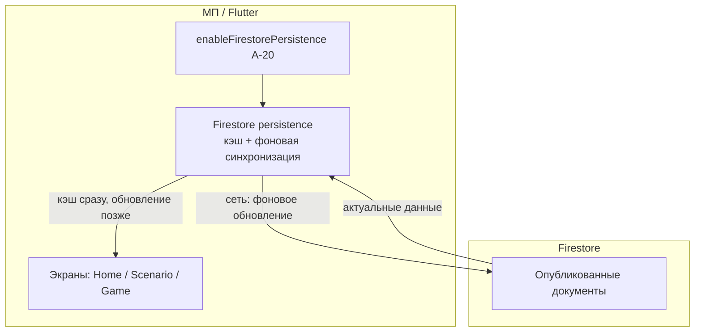

# Спецификация реализации — US-E2-04 «Обновление контента при наличии сети»

## 1. Scope

**В объёме:**

* **Фоновое обновление контента** при активной сети через Firestore persistence (**A-20**, **AC-02**).

* **Отсутствие «пустого» главного экрана** при наличии кэша во время обновления (**AC-01**, **FR-M-3**).

* **Чтение актуальных данных** после синхронизации (**AC-02**).

* **Тесты**: widget-тесты поведения экранов при обновлении (AC-01, AC-02).

**Вне scope:**

* Полная офлайн-логика — **US-E2-05** (реализована; здесь — только поведение при сети).

* Метрики синхронизации — **US-E6-01** (отдельная стори).

* Ручной «сброс» кэша — не требуется (автообновление).

## 2. Требования → шаги

| #  | Требование                                                          | Источник                | Шаги |
| -- | ------------------------------------------------------------------- | ----------------------- | ---- |
| R1 | Фоновое обновление при сети через persistence                       | A-20, AC-02             | 1    |
| R2 | Нет «пустого» экрана при наличии кэша во время обновления           | AC-01, FR-M-3           | 2    |
| R3 | Актуальные данные после синхронизации                               | AC-02                   | 2    |

## 3. Архитектура данных

**Ключевые решения:**

* **Persistence включён** (**A-20**, реализовано в US-E2-05): `FirebaseFirestore.instance.settings = Settings(persistenceEnabled: true)`. Firestore при сети автоматически синхронизирует прочитанные документы (**AC-02**).

* **Кэш сразу, обновление фоново** (**AC-01**, **FR-M-3**): экраны отображают данные из кэша немедленно; обновление подтягивается без «пустого» экрана.

* **Актуальность после синхронизации** (**AC-02**): при новой версии документа клиент в конечном счёте видит свежие данные.

## 4. Шаги (в порядке зависимостей)

### Шаг 1. Включить Firestore persistence (A-20

* **Реализовано в US-E2-05:** `scenario/lib/firestore_config.dart` — `enableFirestorePersistence()`; вызывается в `main.dart` после `Firebase.initializeApp`.

* Это обеспечивает фоновую синхронизацию при сети (**AC-02**) и офлайн-чтение (**US-E2-05**).

### Шаг 2. Поведение экранов при обновлении (AC-01, AC-02

* Экраны Home/Scenario/Game читают через `AggregateRepository`; при наличии кэша данные отображаются сразу, обновление подтягивается фоново (**AC-01**.

* При новой версии документа после синхронизации экран показывает актуальные данные (**AC-02**.

* **Реализовано:** экраны при `data != null` рендерят данные (кэш или свежие); при `data == null` и офлайне — «нет сети» (US-E2-05]. Для сети: при отсутствии кэша — спиннер до загрузки.

* **Реализовано (фоновое обновление):** `HomeScreen` (и др. экраны) перечитывает данные при возврате приложения в активное состояние через `WidgetsBindingObserver.didChangeAppLifecycleState` (A-22, AC-02].

### Шаг 3. Тесты

| AC    | Слой  | Проверка                                             | Где                          |
| ----- | ----- | ---------------------------------------------------- | ---------------------------- |
| AC-01 | widget | Сеть + кэш — данные сразу, без «пустого» экрана      | widget-тест экрана           |
| AC-02 | widget | Новая версия документа — актуальные данные           | widget-тест экрана           |

* Widget-тесты: фейковый `AggregateRepository` возвращает данные (кэш/свежие); проверка рендера без «пустого» экрана.

* **Реализовано:** `scenario/test/refresh_test.dart` — 2 теста (AC-01, AC-02; AC-02 через `handleAppLifecycleStateChanged(resumed)`).

## 5. Файлы

* `docs/product/specs/e2-online-content-refresh.md` — **настоящий документ** (SP-E2-04).

* `scenario/lib/firestore_config.dart` — persistence (реализовано в US-E2-05, A-20).

* `scenario/lib/features/home/home_screen.dart`, `scenario/lib/features/scenario/scenario_screen.dart`, `scenario/lib/features/game/game_screen.dart` — экраны (существуют).

* `scenario/lib/features/home/home_screen.dart` — фоновое обновление при resume (реализовано, A-22/AC-02.

* `scenario/test/refresh_test.dart` — widget-тесты обновления (реализовано, AC-01/AC-02.

## 6. Риски

* **Persistence не включён** — фоновое обновление невозможно. Митиг: включён в US-E2-05 (A-20).

* **«Пустой» экран при задержке** — если кэша нет. Митиг: спиннер до загрузки; при наличии кэша — данные сразу (AC-01).

* **Метрики синхронизации** — вне scope (US-E6-01).

## 7. Follow-up (вне scope)

* Метрики синхронизации — **US-E6-01**.

* Офлайн-логика — **US-E2-05** (реализована).

## 8. Доступы и блокеры

* Включённый persistence (**A-20**) — реализован в US-E2-05.

* **A-40**: секреты — только env/Secret Manager, не в git.

## 9. Verify

Соответствие критериям приёмки **US-E2-04**:

* **AC-01 (FR-M-3)** — при сети и наличии кэша контент отображается сразу, обновление подтягивается без «пустого» главного экрана (widget-тест).

* **AC-02 (A-20)** — при новой версии документа клиент в конечном счёте видит актуальные данные после синхронизации (widget-тест).

Критерий готовности: persistence включён (A-20); экраны при сети рендерят кэш сразу и обновляются фоново; widget-тесты AC-01..AC-02 зелёные.

## 10. История изменений

| Дата       | Автор | Изменение                                                                                                                          |
| ---------- | ----- | ---------------------------------------------------------------------------------------------------------------------------------- |
| 2026-09-07 | AID   | Первая версия (drafted]. Обновление при сети через persistence](A-20): кэш сразу, фоновое обновление](AC-01], актуальность после синхронизации](AC-02]. Persistence реализован в US-E2-05. |
| 2026-09-07 | AID   | Реализовано: фоновое обновление при resume в `home_screen.dart` (WidgetsBindingObserver, A-22]; widget-тесты AC-01/AC-02 (`test/refresh_test.dart`]. |