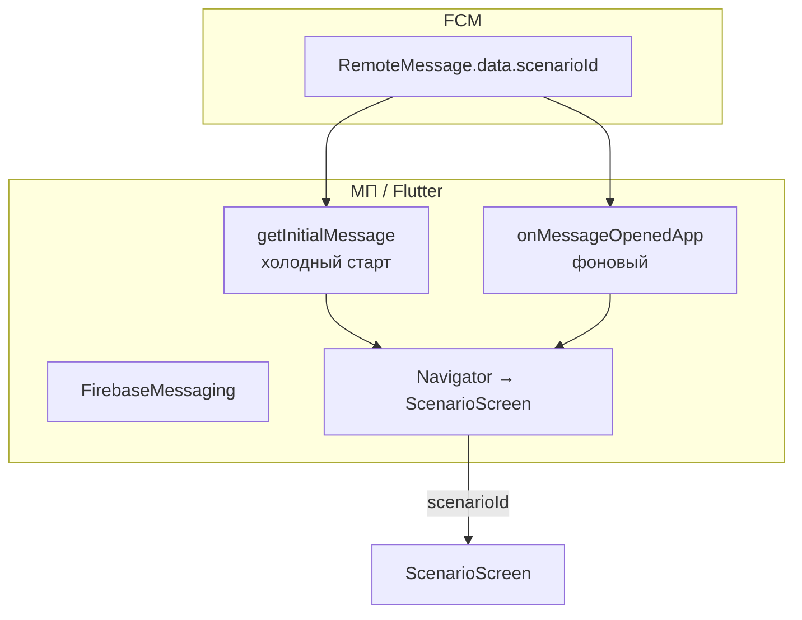

# Спецификация реализации — US-E3-04 «Deep link из push на экран сценария»

## 1. Scope

**В объёме:**

* **Обработка тапа по push** и навигация на экран сценария (**FR-M-4**, **AC-01**).

* **Payload FCM** с `scenarioId` (**A-13**).

* **Холодный старт из уведомления** — восстановление маршрута к сценарию (**AC-02**).

* **Корректная ошибка**, если сценарий не найден (без утечки черновиков, **A-38**).

* **Тесты**: unit/widget-тесты обработки deep link (AC-01, AC-02).

**Вне scope:**

* Universal Links с веба — **E5**.

* Формирование payload на сервере — **US-E3-03** (здесь только чтение `scenarioId`).

## 2. Требования → шаги

| #  | Требование                                                          | Источник          | Шаги |
| -- | ------------------------------------------------------------------- | ----------------- | ---- |
| R1 | Тап по push открывает экран сценария                                | AC-01, FR-M-4     | 2    |
| R2 | Холодный старт восстанавливает маршрут к сценарию                   | AC-02, A-13       | 3    |
| R3 | Сценарий не найден — корректная ошибка                              | A-38              | 2    |

## 3. Архитектура данных

**Ключевые решения:**

* **Payload `scenarioId`** (**A-13**): `RemoteMessage.data['scenarioId']` — идентификатор сценария для навигации.

* **Холодный старт** (**AC-02**): `getInitialMessage()` при запуске — если есть `scenarioId`, открыть сценарий.

* **Фоновый тап** (**AC-01**): `onMessageOpenedApp` — подписка на открытие из фона.

* **Ошибка при отсутствии сценария** (**A-38**): если сценарий не найден — показать корректное состояние, без утечки черновиков.

## 4. Шаги (в порядке зависимостей)

### Шаг 1. Сервис deep link

* `PushDeepLinkService`: читает `scenarioId` из `RemoteMessage.data`.

* Методы: `getInitialScenarioId()` (холодный старт), `onScenarioOpened()` (фоновый поток).

* **Реализовано:** `scenario/lib/features/push/push_deep_link_service.dart` — `PushDeepLinkService` + абстракция `PushDeepLinkSource` (тестируемость).

### Шаг 2. Навигация на сценарий (AC-01)

* При получении `scenarioId` — `Navigator.push` на `ScenarioScreen`.

* Если сценарий не найден — корректная ошибка (без утечки черновиков, A-38).

* **Реализовано:** `_ScenarioAppState._openScenario` в `app.dart` — навигация на `_ScenarioRoute` по `scenarioId`.

### Шаг 3. Холодный старт (AC-02)

* При инициализации приложения `getInitialMessage()` → если `scenarioId` есть — восстановить маршрут к сценарию.

* **Реализовано:** `_listenDeepLinks` в `app.dart` — `getInitialScenarioId()` и `onScenarioOpened()` → `_openScenario`.

### Шаг 4. Тесты

| AC    | Слой  | Проверка                                             | Где                          |
| ----- | ----- | ---------------------------------------------------- | ---------------------------- |
| AC-01 | unit    | Тап по push → навигация на сценарий                  | unit-тест сервиса            |
| AC-02 | unit    | Холодный старт → восстановление маршрута            | unit-тест сервиса            |

* Unit-тесты сервиса deep link (мок RemoteMessage).

* **Реализовано:** `scenario/test/push_deep_link_service_test.dart` — 3 теста (AC-01, AC-02, без уведомления).

## 5. Файлы

* `docs/product/specs/e3-push-deeplink-scenario.md` — **настоящий документ** (SP-E3-04).

* `scenario/lib/features/push/push_deep_link_service.dart` — сервис deep link (реализовано).

* `scenario/lib/app.dart` — навигация на сценарий по `scenarioId` (реализовано).

* `scenario/test/push_deep_link_service_test.dart` — unit-тесты сервиса (реализовано).

## 6. Риски

* **Payload не содержит `scenarioId`** — сервер (`daily-push.mjs`) сейчас шлёт `gameId`, а не `scenarioId`. Митиг: US-E3-03 должен слать `scenarioId`; здесь обрабатывается только `scenarioId`.

* **Сценарий не найден** — корректная ошибка. Митиг: проверка существования, без утечки черновиков (A-38).

## 7. Follow-up (вне scope)

* Формирование payload на сервере — **US-E3-03**.

* Universal Links — **E5**.

## 8. Доступы и блокеры

* Навигация **E2** (реализована).

* Корректный payload от **US-E3-03** (блокер: сервер шлёт `gameId`, не `scenarioId`).

* **A-40**: секреты — только env/Secret Manager, не в git.

## 9. Verify

Соответствие критериям приёмки **US-E3-04**:

* **AC-01 (FR-M-4)** — тап по push открывает экран сценария (unit-тест).

* **AC-02 (A-13)** — холодный старт из уведомления восстанавливает маршрут к сценарию (unit-тест).

Критерий готовности: сервис deep link обрабатывает `scenarioId` из payload; навигация на сценарий работает; unit-тесты AC-01..AC-02 зелёные.

## 10. История изменений

| Дата       | Автор | Изменение                                                                                                                          |
| ---------- | ----- | ---------------------------------------------------------------------------------------------------------------------------------- |
| 2026-09-07 | AID   | Первая версия (drafted]. Deep link из push на сценарий: payload `scenarioId` (A-13], холодный старт (AC-02], навигация (AC-01]. |
| 2026-09-07 | AID   | Реализовано: `push_deep_link_service.dart` (сервис + абстракция], интеграция в `ScenarioApp`; unit-тесты AC-01/AC-02. |