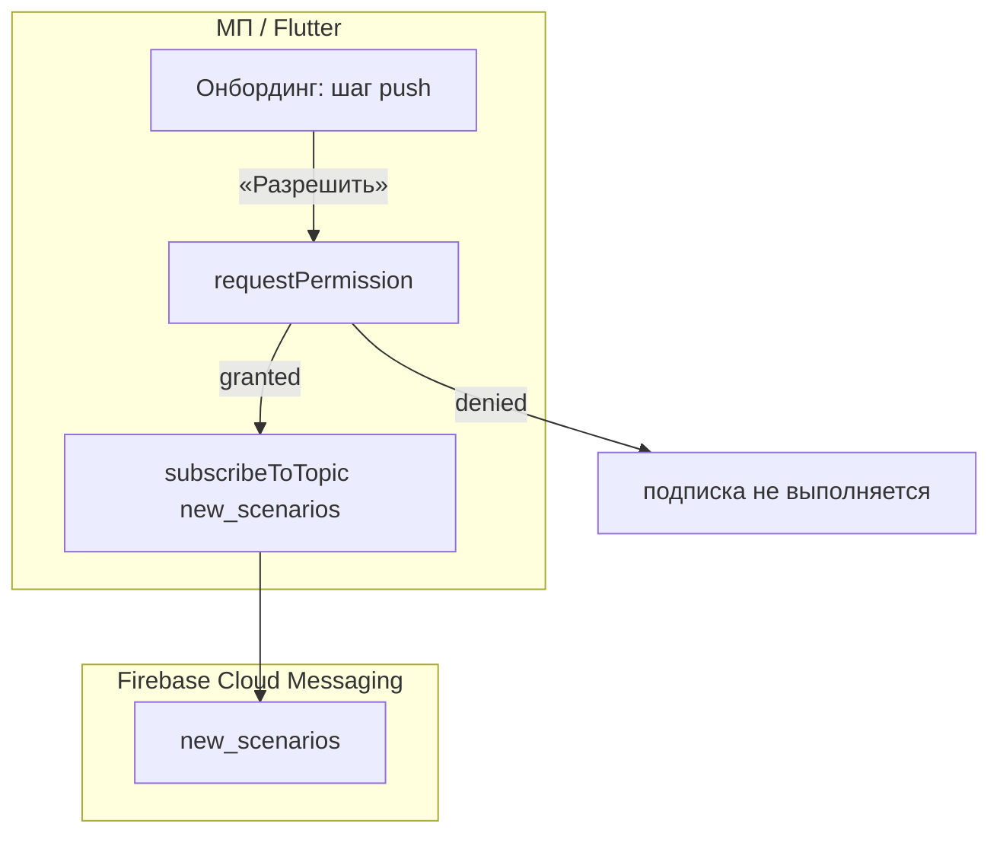

# Спецификация реализации — US-E3-02 «Подписка на уведомления о новых сценариях»

## 1. Scope

**В объёме:**

* **Запрос разрешения на уведомления** и **подписка на FCM topic** `new_scenarios` после согласия (**A-8a**, **SR-PUSH-1**, **AC-01**).

* **Отсутствие подписки без разрешения** (**AC-02**).

* **Интеграция с онбордингом** (US-E3-01): запрос разрешения на шаге онбординга.

* **Тесты**: unit/widget-тесты логики подписки (AC-01, AC-02).

**Вне scope:**

* Дневная отправка push — **US-E3-03**.

* Deep link из push — **US-E3-04**.

* Обработка входящих сообщений/отображение уведомлений — **US-E3-04** (здесь только подписка).

## 2. Требования → шаги

| #  | Требование                                                          | Источник          | Шаги |
| -- | ------------------------------------------------------------------- | ----------------- | ---- |
| R1 | Подписка на topic `new_scenarios` после разрешения                  | AC-01, A-8a, SR-PUSH-1 | 2    |
| R2 | Без разрешения подписка не выполняется                              | AC-02             | 2    |
| R3 | Запрос разрешения в контексте онбординга                            | A-17, US-E3-01    | 3    |

## 3. Архитектура данных

**Ключевые решения:**

* **Topic `new_scenarios`** (**SR-PUSH-1**): подписка на topic новых сценариев (не `daily`).

* **Разрешение → подписка** (**AC-01**): после `requestPermission()` с `authorizationStatus == granted` вызывается `subscribeToTopic('new_scenarios')`.

* **Отказ → без подписки** (**AC-02**): при denied подписка не выполняется, UX не ломается.

## 4. Шаги (в порядке зависимостей)

### Шаг 1. Добавить firebase_messaging

* Зависимость `firebase_messaging: ^15.2.10` (совместима с firebase_core 3.15.2).

* **Реализовано:** добавлена в `pubspec.yaml`.

### Шаг 2. Сервис подписки

* `subscribeToNewScenarios()`: `requestPermission()` → если granted → `subscribeToTopic('new_scenarios')`.

* Возвращает bool (подписан или нет).

* **Реализовано:** `scenario/lib/features/onboarding/push_subscription_service.dart` — `PushSubscriptionService` + абстракция `PushMessaging` (тестируемость).

### Шаг 3. Интеграция с онбордингом

* На шаге «Уведомления о новинках» кнопка «Разрешить» вызывает сервис подписки; «Позже» — пропускает.

* Отказ не блокирует переход к витрине (AC-02, US-E3-01).

* **Реализовано:** `OnboardingScreen.onAllowPush` → `PushSubscriptionService` в `app.dart`.

### Шаг 4. Тесты

| AC    | Слой  | Проверка                                             | Где                          |
| ----- | ----- | ---------------------------------------------------- | ---------------------------- |
| AC-01 | unit    | При granted — подписка на topic выполняется          | unit-тест сервиса            |
| AC-02 | unit    | При denied — подписка не выполняется                 | unit-тест сервиса            |

* Unit-тесты сервиса подписки (мок FirebaseMessaging).

* **Реализовано:** `scenario/test/push_subscription_service_test.dart` — 2 теста (AC-01, AC-02).

## 5. Файлы

* `docs/product/specs/e3-push-subscribe-new-scenarios.md` — **настоящий документ** (SP-E3-02).

* `scenario/pubspec.yaml` — зависимость `firebase_messaging` (реализовано).

* `scenario/lib/features/onboarding/push_subscription_service.dart` — сервис подписки (реализовано).

* `scenario/lib/features/onboarding/onboarding_screen.dart` — шаг push с `onAllowPush` (реализовано).

* `scenario/test/push_subscription_service_test.dart` — unit-тесты сервиса (реализовано).

## 6. Риски

* **firebase_messaging несовместим с firebase_core** — выбрана версия 15.2.10 (совместима с 3.15.2). Митиг: проверка версий.

* **Разрешение не выдано** — подписка не выполняется. Митиг: graceful (AC-02).

* **Topic не совпадает с сервером** — сервер должен слать на `new_scenarios` (SR-PUSH-1). Митиг: согласовать topic.

## 7. Follow-up (вне scope)

* Дневная отправка — **US-E3-03**; deep link — **US-E3-04**.

## 8. Доступы и блокеры

* FCM настроен в проекте.

* **A-40**: секреты — только env/Secret Manager, не в git.

## 9. Verify

Соответствие критериям приёмки **US-E3-02**:

* **AC-01 (A-8a, SR-PUSH-1)** — при разрешении клиент подписан на topic `new_scenarios` (unit-тест).

* **AC-02** — без разрешения подписка не выполняется (unit-тест).

Критерий готовности: сервис подписки реализован, интегрирован в онбординг; unit-тесты AC-01..AC-02 зелёные.

## 10. История изменений

| Дата       | Автор | Изменение                                                                                                                          |
| ---------- | ----- | ---------------------------------------------------------------------------------------------------------------------------------- |
| 2026-09-07 | AID   | Первая версия (drafted]. Подписка на topic `new_scenarios` после разрешения (A-8a, SR-PUSH-1]; отказ — без подписки (AC-02]. |
| 2026-09-07 | AID   | Реализовано: `push_subscription_service.dart` (сервис + абстракция], интеграция в онбординг; unit-тесты AC-01/AC-02. |