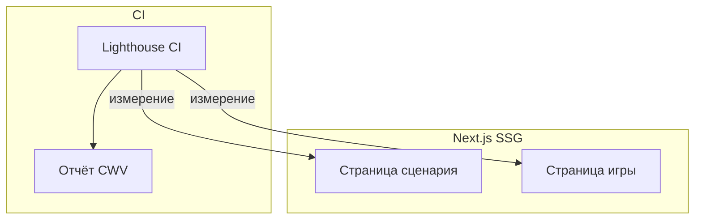

# Спецификация реализации — US-E4-05 «Core Web Vitals и производительность сайта»

## 1. Scope

**В объёме:**

* **Измерение CWV** (LCP, INP, CLS или актуальный набор **§13.1**) на ключевых шаблонах (**NFR-SR-5**, **AC-01**).

* **Регрессии** ловятся в CI/Lighthouse или аналоге по политике команды.

**Вне scope:**

* **Минимальный первый релиз без сайта** — не применимо (сайт уже есть).

## 2. Требования → шаги

| #  | Требование                                                        | Источник          | Шаги |
| -- | ----------------------------------------------------------------- | ----------------- | ---- |
| R1 | Измерение CWV на страницах сценария/игры                          | AC-01, §13.1      | 1    |
| R2 | Регрессии в CI/Lighthouse                                         | AC-01, NFR-SR-5   | 2    |

## 3. Архитектура данных

**Ключевые решения:**

* **Lighthouse CI** в пайплайне сборки (**E4-04**): измерение LCP/INP/CLS на ключевых шаблонах.

* **Пороги** из **СТ §13.1**; регрессии блокируют билд.

## 4. Шаги (в порядке зависимостей)

### Шаг 1. Измерение CWV

* Lighthouse CI на страницах сценария/игры.

* **Реализовано:** `lighthouserc.js` — конфигурация Lighthouse CI (LCP, performance score) на `/scenarios` и `/games`.

### Шаг 2. Пороги и регрессии

* Пороги из **§13.1**; регрессии блокируют билд.

* **Реализовано (ориентировочно):** пороги в `lighthouserc.js` (performance ≥0.8, LCP ≤2500ms); согласовать с §13.1.

### Шаг 3. Тесты

| AC    | Слой  | Проверка                                             | Где                          |
| ----- | ----- | ---------------------------------------------------- | ---------------------------- |
| AC-01 | integration | CWV в целевых порогах на согласованной выборке      | Lighthouse CI                |

* **Реализовано:** шаг Lighthouse CI в `build.yml`.

## 5. Файлы

* `docs/product/specs/e4-core-web-vitals.md` — **настоящий документ** (SP-E4-05).

* `scenario-site/.github/workflows/build.yml` — Lighthouse CI (предлагается).

* `scenario-site/lighthouserc.js` — конфигурация порогов (предлагается).

## 6. Риски

* **Регрессии производительности** — митиг: Lighthouse CI с порогами.

* **Хостинг/ассеты** — митиг: оптимизация ассетов (**ED-3**).

## 7. Follow-up (вне scope)

* Атрибуция установок через MMP.

## 8. Доступы и блокеры

* Хостинг **ED-3**, оптимизация ассетов.

* **A-40**: секреты — только env/Secret Manager, не в git.

## 9. Verify

Соответствие критериям приёмки **US-E4-05**:

* **AC-01 (§13.1, NFR-SR-5)** — CWV в целевых порогах на согласованной выборке (Lighthouse CI).

Критерий готовности: Lighthouse CI с порогами из §13.1; регрессии блокируют билд.

## 10. История изменений

| Дата       | Автор | Изменение |
| ---------- | ----- | --------- |
| 2026-09-08 | AID   | Первая версия (drafted). Измерение CWV, пороги, Lighthouse CI. |
| 2026-09-08 | AID   | Реализовано: `lighthouserc.js` (пороги), шаг Lighthouse CI в `build.yml`. Пороги — ориентировочные, согласовать с §13.1. |