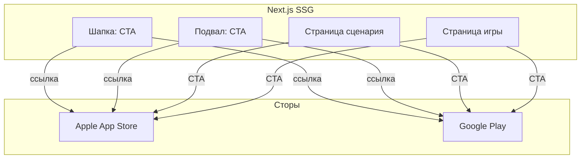

# Спецификация реализации — US-E4-03 «CTA установки мобильного приложения»

## 1. Scope

**В объёме:**

* **CTA установки МП** в шапке/подвале и на контентных страницах (**FR-W-3**, **AC-01/02**).

* **Ссылки в сторы** (iOS/Android) — идентификаторы приложений.

* **Заметность** CTA согласуется с дизайном; клики учитываются в метриках (**use-cases §6.2 п.24–25**).

**Вне scope:**

* Атрибуция установок через MMP — вне этой стори.

* UTM на вебе — связка с **E5** (частично уже есть в share).

## 2. Требования → шаги

| #  | Требование                                                        | Источник          | Шаги |
| -- | ----------------------------------------------------------------- | ----------------- | ---- |
| R1 | CTA на контентных страницах сценария/игры                         | AC-01, FR-W-3      | 2    |
| R2 | CTA в шапке и/или подвале главной страницы                        | AC-02, FR-W-3      | 1    |
| R3 | Ссылки на сторы (iOS/Android)                                     | AC-01, FR-W-3      | 1    |

## 3. Архитектура данных

**Ключевые решения:**

* **Централизованные ссылки на сторы**: константы `STORE_URLS` (iOS/Android) в одном месте (`src/lib/stores.ts`).

* **Компонент `InstallCta`**: переиспользуемый CTA-блок (шапка/подвал/контентные страницы).

* **Заметность**: кнопка с иконками сторов; клики — через ссылки (метрики по UTM).

## 4. Шаги (в порядке зависимостей)

### Шаг 1. Ссылки на сторы

* `src/lib/stores.ts`: константы `STORE_URLS` (iOS/Android).

* **Реализовано:** `stores.ts` — `STORE_URLS` (placeholder-ссылки).

* **Блокер:** идентификаторы приложений в сторах (app id / package name).

### Шаг 2. Компонент CTA

* `src/components/InstallCta.tsx`: переиспользуемый CTA-блок с ссылками на сторы.

* **Реализовано:** `InstallCta.tsx` — компонент с ссылками на сторы.

### Шаг 3. Интеграция

* `layout.tsx`: CTA в шапке и подвале (**AC-02**).

* Страницы сценария/игры: CTA-блок (**AC-01**).

* **Реализовано:** `layout.tsx` (шапка/подвал), `ScenarioClient.tsx`, `GameClient.tsx` (контентные страницы).

### Шаг 4. Тесты

| AC    | Слой  | Проверка                                             | Где                          |
| ----- | ----- | ---------------------------------------------------- | ---------------------------- |
| AC-01 | unit    | CTA присутствует на контентных страницах            | component-тест               |
| AC-02 | unit    | CTA в шапке/подвале                                  | component-тест               |

## 5. Файлы

* `docs/product/specs/e4-cta-install-app.md` — **настоящий документ** (SP-E4-03).

* `scenario-site/src/lib/stores.ts` — ссылки на сторы (предлагается).

* `scenario-site/src/components/InstallCta.tsx` — компонент CTA (предлагается).

* `scenario-site/src/app/layout.tsx` — шапка/подвал (предлагается).

## 6. Риски

* **Нет идентификаторов сторов** — блокер. Митиг: placeholder-ссылки, замена при релизе.

* **CTA не заметен** — митиг: дизайн-ревью.

## 7. Follow-up (вне scope)

* Атрибуция установок через MMP.

## 8. Доступы и блокеры

* **Блокер:** ссылки на сторы (идентификаторы приложений).

* **A-40**: секреты — только env/Secret Manager, не в git.

## 9. Verify

Соответствие критериям приёмки **US-E4-03**:

* **AC-01 (FR-W-3)** — CTA на контентных страницах сценария/игры (component-тест).

* **AC-02** — CTA в шапке и/или подвале (component-тест).

Критерий готовности: компонент `InstallCta` и ссылки на сторы; CTA в шапке/подвале и на контентных страницах.

## 10. История изменений

| Дата       | Автор | Изменение |
| ---------- | ----- | --------- |
| 2026-09-08 | AID   | Первая версия (drafted). CTA установки, ссылки на сторы, компонент InstallCta. |
| 2026-09-08 | AID   | Реализовано: `stores.ts`, `InstallCta.tsx`, CTA в шапке/подвале и на контентных страницах. Ссылки на сторы — placeholder (блокер). |