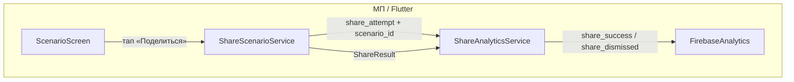

# Спецификация реализации — US-E5-04 «Аналитика воронки шаринга»

## 1. Scope

**В объёме:**

* **Событие попытки шаринга** при тапе «Поделиться» на экране сценария (**AC-01**, **БТ §11.1** п.20, **FR-M-7**).

* **Событие успешного шаринга** при выборе канала в системном share sheet, если платформа возвращает результат (**AC-02**, **БТ §11.1** п.21).

* **Реестр имён событий** для share-воронки по схеме **A-35** (snake_case, без произвольных строк) — минимальный набор, согласованный с **US-E6-01**.

* **Интеграция Firebase Analytics / GA4** (**A-34**) через `firebase_analytics` (уже в `pubspec.yaml`).

* **Тесты**: unit-тесты сервиса аналитики (мок `FirebaseAnalytics`), покрывающие AC-01/AC-02 и TC-01/TC-03.

**Вне scope:**

* Полная атрибуция установок через MMP (**US-E5-04** стори, «Вне scope»).

* Детальные `source` для сценария — **US-E6-02**.

* `block_view` — **US-E6-03**.

* Полный реестр событий навигации (витрина, сценарий, игра) — **US-E6-01**.

## 2. Требования → шаги

| #  | Требование                                                          | Источник          | Шаги |
| -- | ------------------------------------------------------------------- | ----------------- | ---- |
| R1 | Событие попытки шаринга при тапе «Поделиться»                       | AC-01, БТ §11.1 п.20, FR-M-7 | 2, 3 |
| R2 | Событие успешного шаринга при выборе канала (если доступно)         | AC-02, БТ §11.1 п.21 | 2, 3 |
| R3 | Имена событий по реестру A-35 (snake_case, без произвольных строк)   | A-35, US-E6-01     | 1, 2 |
| R4 | Параметр `scenario_id` в событиях воронки                           | A-35, TC-01        | 2, 3 |
| R5 | Отмена share не даёт ложного success                                | TC-03, AC-02       | 2, 3 |

## 3. Архитектура данных

**Ключевые решения:**

* **Единый инструмент аналитики** (**A-34**): Firebase Analytics / GA4 через `firebase_analytics` (уже в `pubspec.yaml`, `^11.6.0`).

* **Имена событий по A-35** (snake_case): `share_attempt` (попытка), `share_success` (успешный выбор канала), `share_dismissed` (отмена). Параметр: `scenario_id`. Имена фиксируются в реестре (Шаг 1) — без произвольных строк (**AC-01 US-E6-01**).

* **Результат share sheet** (**AC-02**): `SharePlus.instance.share` возвращает `ShareResult` со `status` (`success`/`dismissed`/`unavailable`). Успех фиксируется только при `status == success` — воронка не искажается ложными success (**TC-03**).

* **Абстракция для тестируемости**: `ShareAnalyticsService` принимает `FirebaseAnalytics` (или интерфейс-обёртку) — unit-тесты с моком.

## 4. Шаги (в порядке зависимостей)

### Шаг 1. Реестр имён событий share-воронки

* Зафиксировать в коде константы имён событий и параметров (единое место, **A-35**):

  * `share_attempt` — тап «Поделиться» (попытка).
  * `share_success` — успешный выбор канала.
  * `share_dismissed` — отмена share без выбора канала.
  * Параметр: `scenario_id`.

* **Реализовано:** `scenario/lib/analytics/analytics_events.dart` — константы `kEventShareAttempt`, `kEventShareSuccess`, `kEventShareDismissed`, `kParamScenarioId` (US-E6-01).

### Шаг 2. Сервис аналитики шаринга

* `ShareAnalyticsService`: логирует `share_attempt` до вызова share sheet; после получения `ShareResult` — `share_success` или `share_dismissed`.

* Принимает `AnalyticsService` (инжектируется для тестируемости).

* **Реализовано:** `scenario/lib/features/share/share_analytics_service.dart`.

### Шаг 3. Интеграция в share-поток

* `ShareScenarioService.shareScenario` принимает колбэк/сервис аналитики: логирует `share_attempt` перед `_launcher.share`, затем обрабатывает `ShareResult`.

* `ShareLauncher.share` возвращает `ShareResult` (обновление интерфейса).

* `app.dart` (`_ScenarioRoute`): создаёт `ShareAnalyticsService` и передаёт в `ShareScenarioService`.

* **Реализовано:** обновлены `share_scenario_service.dart` (интеграция аналитики).

### Шаг 4. Тесты

| AC    | TC    | Слой  | Проверка                                             | Где                          |
| ----- | ----- | ----- | ---------------------------------------------------- | ---------------------------- |
| AC-01 | TC-01 | unit  | `share_attempt` отправлен с `scenario_id` при тапе   | unit-тест сервиса аналитики  |
| AC-02 | TC-02 | unit  | `share_success` при `ShareResult.status == success`  | unit-тест сервиса аналитики  |
| AC-02 | TC-03 | unit  | `share_dismissed` при отмене; нет ложного success    | unit-тест сервиса аналитики  |

* Unit-тесты сервиса аналитики (мок `AnalyticsService`).

* **Реализовано:** `scenario/test/share_analytics_service_test.dart`.

## 5. Файлы

* `docs/product/specs/e5-share-funnel-analytics.md` — **настоящий документ** (SP-E5-04).

* `scenario/lib/analytics/analytics_events.dart` — реестр имён событий (US-E6-01).

* `scenario/lib/features/share/share_analytics_service.dart` — сервис аналитики шаринга (новый).

* `scenario/lib/features/share/share_scenario_service.dart` — интеграция аналитики в share-поток (изменение).

* `scenario/test/share_analytics_service_test.dart` — unit-тесты (новый).

## 6. Риски

* **Платформа не возвращает результат share** — на части платформ `ShareResult.status` может быть `unavailable`. Митиг: `share_success` только при явном `success`; иначе — только `share_attempt` (задокументировано в TC-02).

* **Имена событий разойдутся с US-E6-01** — реестр фиксируется в одном месте (`analytics_events.dart`); при реализации E6-01 имена переиспользуются, без дублирования.

* **`firebase_analytics` не инициализирована** — в тестах мок; в бою `FirebaseAnalytics.instance` доступен после `Firebase.initializeApp` (уже в `main.dart`).

## 7. Follow-up (вне scope)

* Полный реестр событий навигации — **US-E6-01**.

* Детальные `source` для сценария — **US-E6-02**.

* `block_view` — **US-E6-03**.

* Веб-fallback / UTM-воронка с вебом — после **E4**.

## 8. Доступы и блокеры

* **Блокер: US-E6-01** — именованная схема событий (**A-35**) не реализована (спека SP-E6-01 отсутствует). Для этой стори фиксируется минимальный реестр share-событий; полный реестр — в US-E6-01.

* **A-34**: Firebase Analytics — единственный инструмент аналитики.

* **A-40**: секреты — только env/Secret Manager, не в git.

## 9. Verify

Соответствие критериям приёмки **US-E5-04**:

* **AC-01 (БТ §11.1 п.20)** — тап «Поделиться» отправляет `share_attempt` с `scenario_id` (unit-тест, TC-01).

* **AC-02 (БТ §11.1 п.21)** — при `ShareResult.status == success` отправляется `share_success`; при отмене — `share_dismissed`, без ложного success (unit-тесты, TC-02/TC-03).

Критерий готовности: сервис аналитики логирует попытку и результат share по реестру A-35; unit-тесты AC-01..AC-02 зелёные.

## 10. История изменений

| Дата       | Автор | Изменение |
| ---------- | ----- | --------- |
| 2026-09-07 | AID   | Первая версия (drafted]. Аналитика воронки шаринга: события `share_attempt`/`share_success`/`share_dismissed` по A-35, параметр `scenario_id`, Firebase Analytics (A-34], обработка `ShareResult` (AC-02, TC-03]. |
| 2026-09-07 | AID   | Реализовано: `share_analytics_service.dart`, интеграция в `ShareScenarioService` (ShareResult, логирование attempt/result); unit-тесты AC-01/AC-02. |