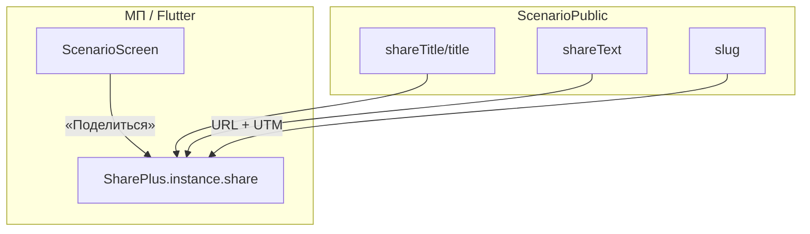

# Спецификация реализации — US-E5-01 «Поделиться сценарием через системный share»

## 1. Scope

**В объёме:**

* **Действие «Поделиться»** на экране сценария, открывающее системный share sheet (**FR-M-7**, **AC-01**).

* **Формирование share-контента**: текст + URL с UTM из полей контента (**US-E1-04**, **AC-02**).

* **URL сценария** `https://scenario-games.ru/scenario/{slug}` (**A-23**).

* **Тесты**: unit/widget-тесты формирования share-контента (AC-01, AC-02).

**Вне scope:**

* Открытие ссылки в приложении — **US-E5-02**.

* Веб-fallback / OG — **US-E5-03**.

* Аналитика воронки — **US-E5-04**.

## 2. Требования → шаги

| #  | Требование                                                          | Источник          | Шаги |
| -- | ------------------------------------------------------------------- | ----------------- | ---- |
| R1 | Системный share с текстом и URL с UTM                               | AC-01, FR-M-7     | 2    |
| R2 | Текст/описание из полей контента                                    | AC-02, US-E1-04   | 2    |
| R3 | URL сценария с UTM                                                  | A-23, A-18        | 2    |

## 3. Архитектура данных

**Ключевые решения:**

* **Системный share** (**FR-M-7**): `SharePlus.instance.share(ShareParams(text, uri))` — платформенный share sheet (A-18).

* **Контент из данных** (**AC-02**, **US-E1-04**): `shareTitle`/`shareText` из `ScenarioPublic`; fallback на `title`.

* **URL с UTM** (**A-23**, **A-18**): `https://scenario-games.ru/scenario/{slug}?utm_source=...`.

## 4. Шаги (в порядке зависимостей)

### Шаг 1. Добавить share_plus

* Зависимость `share_plus` (совместима с Dart 3.11, Flutter 3.47).

* **Реализовано:** `share_plus: ^13.3.0` в `pubspec.yaml`.

### Шаг 2. Сервис шаринга

* `ShareScenarioService`: формирует текст и URL из `ScenarioPublic`, вызывает `SharePlus.instance.share`.

* Текст: `shareText ?? title`; URL: `https://scenario-games.ru/scenario/{slug}` + UTM.

* **Реализовано:** `scenario/lib/features/share/share_scenario_service.dart` — `ShareScenarioService` + абстракция `ShareLauncher`.

### Шаг 3. Кнопка «Поделиться» на экране сценария

* Добавить действие «Поделиться» на `ScenarioScreen` (AppBar или кнопка).

* Тап → сервис шаринга.

* **Реализовано:** кнопка share в AppBar `ScenarioScreen`; `onShare` → сервис в `app.dart`.

### Шаг 4. Тесты

| AC    | Слой  | Проверка                                             | Где                          |
| ----- | ----- | ---------------------------------------------------- | ---------------------------- |
| AC-01 | unit    | Формирование URL с UTM и текста                      | unit-тест сервиса            |
| AC-02 | unit    | Текст из полей контента (не заглушка)                | unit-тест сервиса            |

* Unit-тесты сервиса (мок SharePlus).

* **Реализовано:** `scenario/test/share_scenario_service_test.dart` — 4 теста (AC-01, AC-02).

## 5. Файлы

* `docs/product/specs/e5-share-scenario-system-share.md` — **настоящий документ** (SP-E5-01).

* `scenario/pubspec.yaml` — зависимость `share_plus` (реализовано).

* `scenario/lib/features/share/share_scenario_service.dart` — сервис шаринга (реализовано).

* `scenario/lib/features/scenario/scenario_screen.dart` — кнопка «Поделиться» (реализовано).

* `scenario/test/share_scenario_service_test.dart` — unit-тесты сервиса (реализовано).

## 6. Риски

* **share_plus несовместим** — проверка версии (Dart 3.11, Flutter 3.47). Митиг: версия 13.x.

* **URL/UTM не согласованы** — согласовать с A-23/A-25. Митиг: фиксированный формат.

* **Share-поля не заполнены** — fallback на title. Митиг: `shareText ?? title`.

## 7. Follow-up (вне scope)

* Открытие в приложении — **US-E5-02**; веб-fallback — **US-E5-03**; аналитика — **US-E5-04**.

## 8. Доступы и блокеры

* Публичный URL сценария (домен scenario-games.ru, A-23).

* Данные **E1-04** (реализованы).

* **A-40**: секреты — только env/Secret Manager, не в git.

## 9. Verify

Соответствие критериям приёмки **US-E5-01**:

* **AC-01 (FR-M-7)** — тап «Поделиться» отправляет URL с UTM и текст (unit-тест).

* **AC-02** — текст из полей контента, не заглушка (unit-тест).

Критерий готовности: сервис шаринга формирует контент из данных и вызывает системный share; unit-тесты AC-01..AC-02 зелёные.

## 10. История изменений

| Дата       | Автор | Изменение                                                                                                                          |
| ---------- | ----- | ---------------------------------------------------------------------------------------------------------------------------------- |
| 2026-09-07 | AID   | Первая версия (drafted]. Системный share сценария: текст/URL из данных (US-E1-04], URL с UTM (A-23], SharePlus (A-18]. |
| 2026-09-07 | AID   | Реализовано: `share_scenario_service.dart` (сервис + абстракция], кнопка share в `ScenarioScreen`; unit-тесты AC-01/AC-02. |