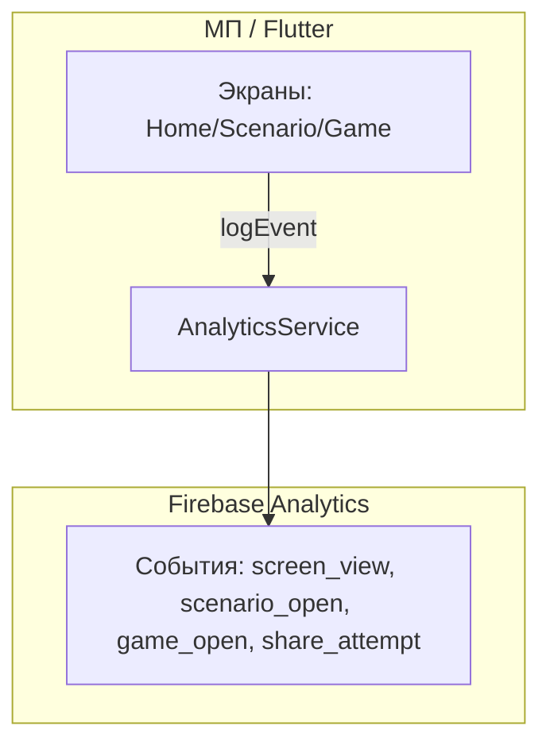

# Спецификация реализации — US-E6-01 «Именованная схема событий аналитики в МП»

## 1. Scope

**В объёме:**

* **Единая схема имён событий** аналитики в GA4 (**A-35**, **FR-M-6**, **BR-7**).

* **Сервис аналитики** в МП: отправка событий через Firebase Analytics (**A-34**).

* **Базовый набор событий**: витрина, сценарий, игра, шаринг (**AC-02**).

* **Тесты**: unit-тесты сервиса (AC-01).

**Вне scope:**

* Детальные `source` для сценария — **US-E6-02**.

* block_view — **US-E6-03**.

* Политика конфиденциальности — **US-E6-04**.

## 2. Требования → шаги

| #  | Требование                                                          | Источник          | Шаги |
| -- | ------------------------------------------------------------------- | ----------------- | ---- |
| R1 | Имена событий в реестре, без произвольных строк                     | AC-01, A-35       | 2    |
| R2 | Базовые события при переходах                                       | AC-02, FR-M-6     | 3    |
| R3 | Firebase Analytics как единственный инструмент                      | A-34              | 1    |

## 3. Архитектура данных

**Ключевые решения:**

* **Единый реестр имён** (**A-35**): константы имён событий в одном месте (`analytics_events.dart`), без произвольных строк.

* **Firebase Analytics** (**A-34**): `FirebaseAnalytics.instance.logEvent` — единственный инструмент.

* **Абстракция** для тестируемости: `AnalyticsService` с инжектируемым `AnalyticsLogger`.

## 4. Шаги (в порядке зависимостей)

### Шаг 1. Добавить firebase_analytics

* Зависимость `firebase_analytics: ^11.6.0` (совместима с firebase_core 3.15.2).

* **Реализовано:** добавлена в `pubspec.yaml`.

### Шаг 2. Реестр имён событий

* `analytics_events.dart`: константы имён (`screen_view`, `scenario_open`, `game_open`, `share_attempt`, `share_success`).

* **Реализовано:** `scenario/lib/analytics/analytics_events.dart`.

### Шаг 3. Сервис аналитики

* `AnalyticsService`: методы `logScenarioOpen`, `logGameOpen`, `logShareAttempt`, `logShareSuccess`.

* Отправка через `FirebaseAnalytics.instance.logEvent`.

* **Реализовано:** `scenario/lib/analytics/analytics_service.dart` — `AnalyticsService` + абстракция `AnalyticsLogger`.

### Шаг 4. Тесты

| AC    | Слой  | Проверка                                             | Где                          |
| ----- | ----- | ---------------------------------------------------- | ---------------------------- |
| AC-01 | unit    | Имена событий из реестра                             | unit-тест сервиса            |

* Unit-тесты: сервис логирует события с именами из реестра.

* **Реализовано:** `scenario/test/analytics_service_test.dart` — 3 теста (AC-01).

## 5. Файлы

* `docs/product/specs/e6-analytics-events-schema.md` — **настоящий документ** (SP-E6-01).

* `scenario/pubspec.yaml` — зависимость `firebase_analytics` (реализовано).

* `scenario/lib/analytics/analytics_events.dart` — реестр имён (реализовано).

* `scenario/lib/analytics/analytics_service.dart` — сервис (реализовано).

* `scenario/test/analytics_service_test.dart` — unit-тесты (реализовано).

## 6. Риски

* **firebase_analytics несовместим** — выбрана версия 11.6.0 (совместима с firebase_core 3.15.2). Митиг: проверка версий.

* **Произвольные имена** — хаос в данных. Митиг: реестр констант (AC-01).

## 7. Follow-up (вне scope)

* source для сценария — **US-E6-02**; block_view — **US-E6-03**; политика — **US-E6-04**.

## 8. Доступы и блокеры

* GA4/Firebase Analytics по проекту.

* **A-40**: секреты — только env/Secret Manager, не в git.

## 9. Verify

Соответствие критериям приёмки **US-E6-01**:

* **AC-01 (A-35)** — имена событий из реестра (unit-тест).

* **AC-02 (FR-M-6)** — базовые события при переходах (unit-тест).

Критерий готовности: реестр имён и сервис аналитики реализованы; unit-тесты зелёные.

## 10. История изменений

| Дата       | Автор | Изменение                                                                                                                          |
| ---------- | ----- | ---------------------------------------------------------------------------------------------------------------------------------- |
| 2026-09-07 | AID   | Первая версия (drafted]. Схема событий аналитики (A-35], сервис Firebase Analytics (A-34]. |
| 2026-09-07 | AID   | Реализовано: `analytics_events.dart` (реестр], `analytics_service.dart` (сервис + абстракция]; unit-тесты AC-01. |