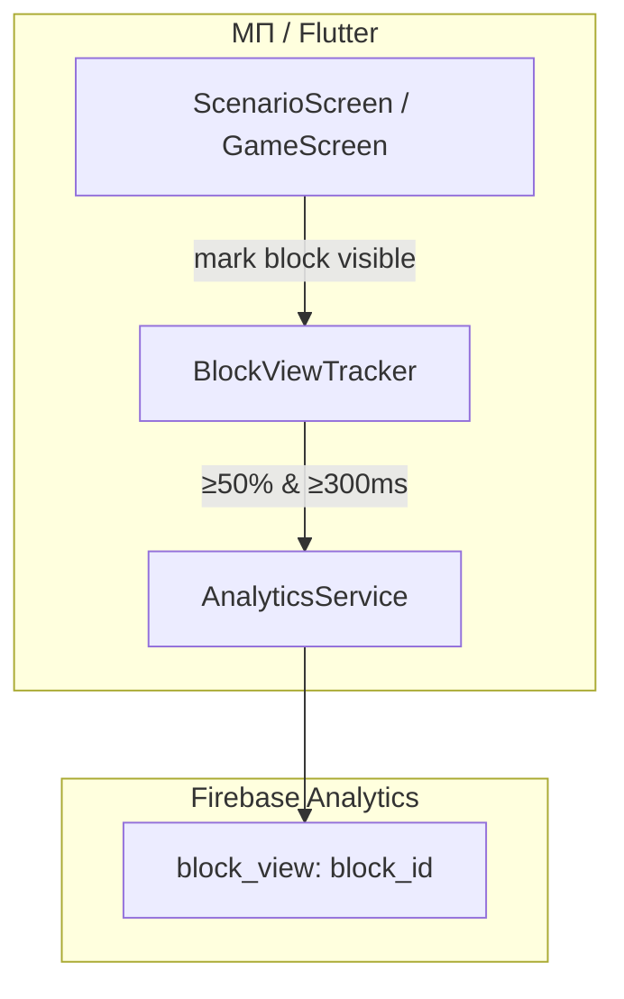

# Спецификация реализации — US-E6-03 «События block_view с порогом viewport»

## 1. Scope

**В объёме:**

* **Событие `block_view`** при появлении именованного блока в viewport (**A-35(3)**, **FR-M-6**).

* **Порог viewport**: ≥ 50% площади блока видимо ≥ 300 ms (debounce) (**A-36**).

* **Одно срабатывание на блок за сессию экрана** (**A-36**, **AC-02**).

* **Именованные блоки** на экранах сценария и игры; стабильные `block_id` (**AC-01**, примечание стори).

* **Тесты**: widget-тесты порога и отсутствия дубликата (**TC-01, TC-02, TC-04**).

**Вне scope:**

* Сторонние heatmaps.

* Определение «сессии экрана» при back-навигации — синхронизировать с разработкой (**открытый вопрос TC-03**).

## 2. Требования → шаги

| #  | Требование                                                        | Источник          | Шаги |
| -- | ----------------------------------------------------------------- | ----------------- | ---- |
| R1 | `block_view` при ≥50% площади и ≥300 ms (debounce)                | AC-01, A-36       | 3    |
| R2 | Одно срабатывание на блок за сессию экрана                        | AC-02, A-36       | 4    |
| R3 | Стабильные `block_id`, согласованные с контрактом                 | AC-01, A-35       | 2    |
| R4 | Блоки на экранах сценария и игры                                  | AC-01, FR-M-6     | 2    |

## 3. Архитектура данных

**Ключевые решения:**

* **Трекер видимости** `BlockViewTracker`: следит за долей видимой площади блока и временем удержания; срабатывает один раз на `block_id` за сессию экрана (**A-36**).

* **Debounce 300 ms**: событие отправляется только после удержания ≥300 ms при ≥50% видимости (**A-36**).

* **Реестр `block_id`**: константы имён блоков рядом со схемой событий (**A-35**, примечание стори).

* **Абстракция таймера** для тестируемости (мок времени в widget-тестах).

## 4. Шаги (в порядке зависимостей)

### Шаг 1. Реестр block_id

* `analytics_events.dart`: константы `block_id` для блоков сценария и игры (например `scenario_why`, `scenario_games`, `game_carousel`, `game_characteristics`).

* **Реализовано:** `analytics_events.dart` — `kEventBlockView`, `kParamBlockId`, константы `kBlockScenarioWhy`, `kBlockScenarioGames`, `kBlockGameCarousel`, `kBlockGameCharacteristics`.

### Шаг 2. Разметка блоков

* `scenario_screen.dart` / `game_screen.dart`: именованные блоки с уникальным `block_id`.

* **Реализовано (вариант A):** `BlockViewReporter` — обёртка блока, подписывается на `Scrollable.position` и сообщает трекеру видимость (1.0/0.0) по scroll offset. Подключен в `ScenarioScreen` (`scenario_why`, `scenario_games`) и `GameScreen` (`game_carousel`, `game_characteristics`).

* **Follow-up:** точный расчёт ≥50% площади (A-36) — требует layout-интроспекции Material ScrollView.

### Шаг 3. Трекер видимости

* `BlockViewTracker`: расчёт доли видимой площади, debounce 300 ms, одно срабатывание на блок за сессию экрана.

* Отправка `block_view` через `AnalyticsService`.

* **Реализовано:** `block_view_tracker.dart` — `BlockViewTracker` (порог ≥50%, удержание ≥300 ms, одно на блок за сессию, `resetSession`); `analytics_service.dart` — `logBlockView(blockId)`.

### Шаг 4. Тесты

| AC    | Слой  | Проверка                                             | Где                          |
| ----- | ----- | ---------------------------------------------------- | ---------------------------- |
| AC-01 | widget  | Порог 50% и 300 ms → одно `block_view`               | widget-тест трекера          |
| AC-01 | widget  | Быстрый проскок <300 ms → нет события                | widget-тест (negative)       |
| AC-02 | widget  | Скролл туда-обратно → нет повторного события         | widget-тест                  |

* **Реализовано:** `block_view_tracker_test.dart` — 4 теста (AC-01, AC-02).

## 5. Файлы

* `docs/product/specs/e6-block-view-events.md` — **настоящий документ** (SP-E6-03).

* `scenario/lib/analytics/analytics_events.dart` — реестр `block_id` (предлагается).

* `scenario/lib/analytics/block_view_tracker.dart` — трекер видимости (предлагается).

* `scenario/lib/analytics/analytics_service.dart` — метод `logBlockView(blockId)` (предлагается).

* `scenario/lib/features/scenario/scenario_screen.dart` — разметка блоков (предлагается).

* `scenario/lib/features/game/game_screen.dart` — разметка блоков (предлагается).

* `scenario/test/block_view_tracker_test.dart` — widget-тесты (предлагается).

## 6. Риски

* **Сложность расчёта видимой площади** — митиг: изолированный трекер с моком таймера.

* **Определение «сессии экрана» при back** — открытый вопрос; зафиксировать в коде и тесте (**TC-03**).

* **Регресс вёрстки E2** — митиг: widget-тесты порога.

## 7. Follow-up (вне scope)

* Сторонние heatmaps.

* Уточнение «сессии экрана» при back-навигации — синхронизировать с разработкой.

## 8. Доступы и блокеры

* Firebase Analytics по проекту (уже подключён, **A-34**).

* **A-40**: секреты — только env/Secret Manager, не в git.

## 9. Verify

Соответствие критериям приёмки **US-E6-03**:

* **AC-01 (A-36)** — `block_view` при ≥50% площади и ≥300 ms (widget-тест).

* **AC-02** — нет повторного события за сессию экрана при скролле туда-обратно (widget-тест).

Критерий готовности: трекер видимости и разметка блоков реализованы; widget-тесты зелёные.

## 10. История изменений

| Дата       | Автор | Изменение |
| ---------- | ----- | --------- |
| 2026-09-08 | AID   | Первая версия (drafted). Трекер видимости, порог A-36, реестр block_id. |
| 2026-09-08 | AID   | Реализовано: `BlockViewTracker`, `logBlockView`, реестр block_id; экраны принимают трекер и сбрасывают сессию; unit-тесты. Точное вычисление viewport — follow-up. |
| 2026-09-08 | AID   | Вариант A: `BlockViewReporter` — видимость по scroll offset (1.0/0.0), подключен в экраны сценария и игры. Точный расчёт ≥50% — follow-up. |