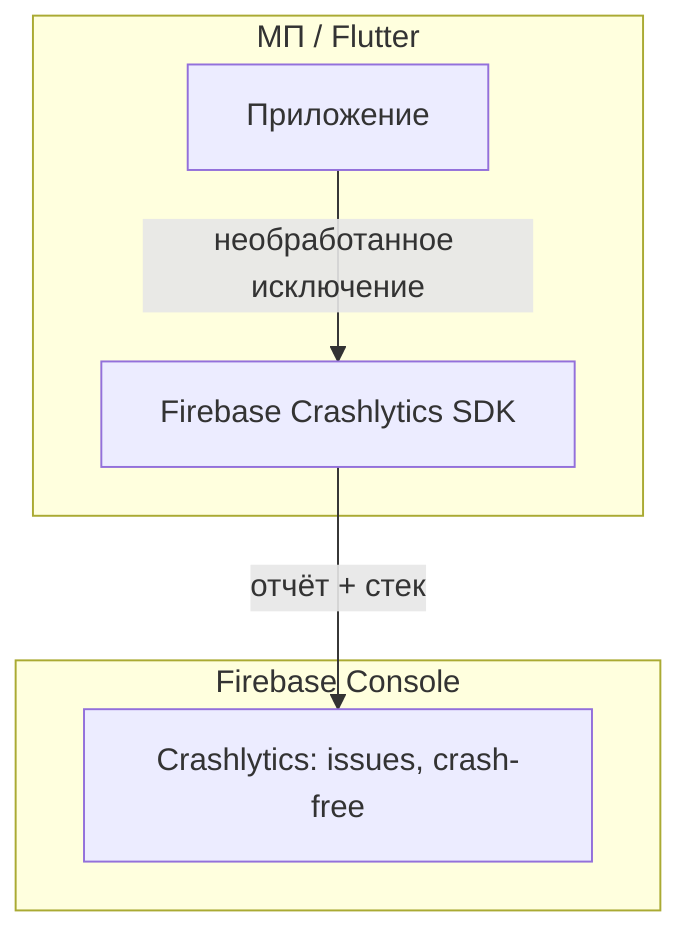

# Спецификация реализации — US-E6-05 «Crashlytics: отчёты о сбоях»

## 1. Scope

**В объёме:**

* **Подключение Firebase Crashlytics** к сборкам production (и при необходимости staging) (**A-41**).

* **Символикация** для iOS/Android (dSYM / Android mapping) — читаемые стеки (**AC-01**, **TC-02**).

* **Метрики crash-free sessions/users** в консоли (**AC-02**, **TC-03**).

* **Отсутствие PII** в кастомных ключах Crashlytics (**TC-04**, примечание стори).

**Вне scope:**

* Алерты по Cloud Functions — до появления фоновых задач (**use-cases §6.2**).

## 2. Требования → шаги

| #  | Требование                                                        | Источник          | Шаги |
| -- | ----------------------------------------------------------------- | ----------------- | ---- |
| R1 | Crashlytics подключён к production-сборкам                        | AC-01, A-41       | 1    |
| R2 | Символикация iOS/Android настроена                                | AC-01, TC-02      | 2    |
| R3 | Метрики crash-free в консоли                                      | AC-02, TC-03      | 3    |
| R4 | Без PII в кастомных ключах                                        | TC-04, примечание | 4    |

## 3. Архитектура данных

**Ключевые решения:**

* **Firebase Crashlytics** (**A-41**): SDK инициализируется в `main.dart` вместе с Firebase.

* **Символикация**: CI загружает dSYM (iOS) / mapping (Android) для релизных сборок (**TC-02**).

* **Без PII**: не устанавливать email/телефон в кастомные ключи Crashlytics (**TC-04**).

## 4. Шаги (в порядке зависимостей)

### Шаг 1. Подключить Crashlytics

* Зависимость и инициализация Crashlytics в `main.dart` (production).

* **Реализовано:** `pubspec.yaml` — `firebase_crashlytics: ^4.3.10` (совместима с firebase_core 3.x); `main.dart` — `setCrashlyticsCollectionEnabled(true)` для dev и prod.

### Шаг 2. Символикация в CI

* Настройка загрузки dSYM / Android mapping в CI для релизных сборок.

* **Не реализовано:** требует доступа к Firebase project и настройки CI (e2e).

### Шаг 3. Метрики в консоли

* Проверка доступности crash-free sessions/users в Firebase Console.

### Шаг 4. Тесты

| AC    | Слой  | Проверка                                             | Где                          |
| ----- | ----- | ---------------------------------------------------- | ---------------------------- |
| AC-01 | manual-only | Тестовый краш → отчёт с читаемым стеком             | e2e (TC-01)                  |
| AC-01 | integration | CI загружает dSYM для iOS-релизов                    | CI (TC-02)                   |
| AC-02 | manual-only | Метрики crash-free в консоли                         | e2e (TC-03)                  |
| AC-01 | unit / review | Нет PII в custom keys                                | code review (TC-04)          |

## 5. Файлы

* `docs/product/specs/e6-crashlytics.md` — **настоящий документ** (SP-E6-05).

* `scenario/pubspec.yaml` — зависимость Crashlytics (предлагается).

* `scenario/lib/main.dart` — инициализация Crashlytics (предлагается).

* CI-конфигурация — загрузка dSYM / mapping (предлагается).

## 6. Риски

* **Символикация не настроена** — стеки без имён функций. Митиг: CI-загрузка dSYM/mapping (**TC-02**).

* **PII в custom keys** — нарушение приватности. Митиг: code review (**TC-04**).

## 7. Follow-up (вне scope)

* Алерты по Cloud Functions.

## 8. Доступы и блокеры

* **Блокер:** Firebase project и права доступа команды (**зависимости стори**).

* **A-40**: секреты — только env/Secret Manager, не в git.

## 9. Verify

Соответствие критериям приёмки **US-E6-05**:

* **AC-01 (A-41)** — тестовый краш появляется в Crashlytics с корректным стеком (e2e).

* **AC-02** — метрики crash-free sessions/users доступны в консоли (e2e).

Критерий готовности: Crashlytics подключён, символикация настроена, PII отсутствует.

## 10. История изменений

| Дата       | Автор | Изменение |
| ---------- | ----- | --------- |
| 2026-09-08 | AID   | Первая версия (drafted). Подключение Crashlytics, символикация, метрики, отсутствие PII. |
| 2026-09-08 | AID   | Реализовано: зависимость `firebase_crashlytics` и инициализация в `main.dart` (dev+prod). Символикация/метрики — e2e (требуют доступа к Firebase project). |