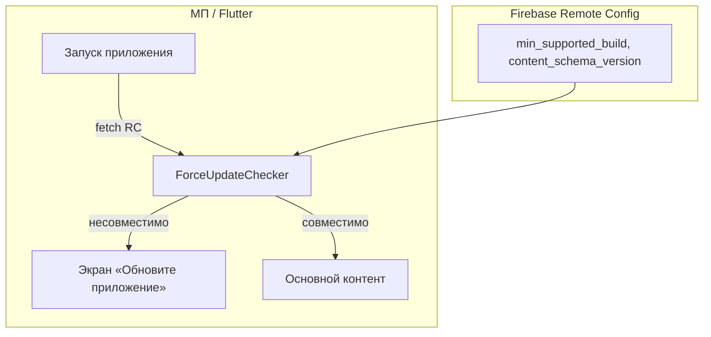

# Спецификация реализации — US-E6-06 «Принудительное обновление через Remote Config»

## 1. Scope

**В объёме:**

* **Remote Config** с параметрами `min_supported_build` и `content_schema_version` (**A-45**, **ADR-013**).

* **Блокирующий экран «обновите приложение»** при несовместимости (**AC-01**, **A-45**).

* **Ветка обновления** при несовместимой `content_schema_version` (**AC-02**).

* **Тесты**: widget-тесты блокировки и совместимой сборки (**TC-01, TC-02, TC-04**).

**Вне scope:**

* Серверное принуждение вне клиента.

* Политика текста и ссылок на сторы — продукт/дизайн.

## 2. Требования → шаги

| #  | Требование                                                        | Источник          | Шаги |
| -- | ----------------------------------------------------------------- | ----------------- | ---- |
| R1 | RC экспонирует `min_supported_build` и `content_schema_version`   | AC-01, A-45       | 1    |
| R2 | Блокирующий экран при несовместимости, обход невозможен           | AC-01, TC-01/02   | 3    |
| R3 | Ветка обновления при несовместимой `content_schema_version`       | AC-02, TC-03      | 3    |
| R4 | Совместимая сборка — обычный доступ                                | AC-01, TC-04      | 4    |

## 3. Архитектура данных

**Ключевые решения:**

* **ForceUpdateChecker**: сравнивает `min_supported_build` с текущей сборкой и `content_schema_version` с поддерживаемой клиентом (**A-45**, **ADR-013**).

* **Блокирующий экран**: при несовместимости основной контент недоступен; CTA в стор (**AC-01**).

* **Абстракция Remote Config** для тестируемости.

## 4. Шаги (в порядке зависимостей)

### Шаг 1. Конфигурация Remote Config

* Параметры `min_supported_build`, `content_schema_version` в Firebase Remote Config.

* **Не реализовано:** требует Firebase Remote Config (follow-up, US-E8-04).

### Шаг 2. Проверка совместимости

* `ForceUpdateChecker`: сравнение с локальными значениями сборки и версии схемы.

* **Реализовано:** `force_update_checker.dart` — `ForceUpdateChecker` + `RemoteConfigSource` (абстракция); константы `kCurrentBuildNumber=1`, `kSupportedContentSchemaVersion=2`.

### Шаг 3. Блокирующий экран

* Экран «Обновите приложение» с CTA в стор; обход невозможен для основного контента (**TC-02**).

* **Реализовано (placeholder):** `update_screen.dart` — `UpdateScreen`; готовая политика и CTA — **US-E8-04**.

### Шаг 4. Тесты

| AC    | Слой  | Проверка                                             | Где                          |
| ----- | ----- | ---------------------------------------------------- | ---------------------------- |
| AC-01 | widget  | `min_supported_build` выше → экран обновления        | widget-тест (TC-01)          |
| AC-01 | widget  | Обход (back/deep link) невозможен                    | widget-тест (TC-02)          |
| AC-02 | widget  | Несовместимая `content_schema_version` → ветка обновления | widget-тест (TC-03)     |
| AC-01 | widget  | Совместимая сборка → обычный доступ                  | widget-тест (TC-04)          |

* **Реализовано:** `force_update_checker_test.dart` — unit-тесты (AC-01, AC-02); `update_screen_test.dart` — widget-тест.

## 5. Файлы

* `docs/product/specs/e6-force-update-remote-config.md` — **настоящий документ** (SP-E6-06).

* `scenario/lib/force_update/force_update_checker.dart` — проверка совместимости (предлагается).

* `scenario/lib/force_update/update_screen.dart` — блокирующий экран (предлагается).

* `scenario/lib/app.dart` — интеграция проверки при старте (предлагается).

* `scenario/test/force_update_checker_test.dart` — widget-тесты (предлагается).

## 6. Риски

* **Обход блокировки** — митиг: проверка на уровне старта и навигации (**TC-02**).

* **Смена контракта E0** — митиг: согласовать `content_schema_version` с E0 (**примечание стори**).

## 7. Follow-up (вне scope)

* Серверное принуждение вне клиента.

* Политика текста и ссылок на сторы.

## 8. Доступы и блокеры

* **Блокер:** Firebase Remote Config и публикация параметров (**зависимости стори**).

* **A-40**: секреты — только env/Secret Manager, не в git.

## 9. Verify

Соответствие критериям приёмки **US-E6-06**:

* **AC-01 (A-45)** — блокирующий экран при `min_supported_build` выше текущей сборки; обход невозможен (widget-тест).

* **AC-02** — ветка обновления при несовместимой `content_schema_version` (widget-тест).

Критерий готовности: ForceUpdateChecker и блокирующий экран реализованы; widget-тесты зелёные.

## 10. История изменений

| Дата       | Автор | Изменение |
| ---------- | ----- | --------- |
| 2026-09-08 | AID   | Первая версия (drafted). Remote Config, ForceUpdateChecker, блокирующий экран. |
| 2026-09-08 | AID   | Реализовано: `ForceUpdateChecker`, `RemoteConfigSource`, placeholder `UpdateScreen`; unit/widget-тесты. Реальная интеграция RC и готовый экран — **US-E8-04**. |