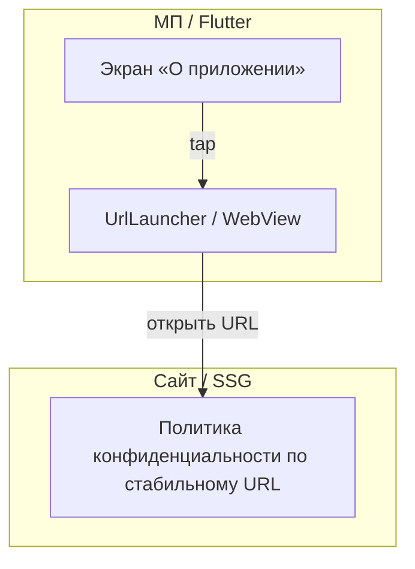

# Спецификация реализации — US-E6-04 «Ссылка на политику конфиденциальности в МП»

## 1. Scope

**В объёме:**

* **Вход к политике конфиденциальности** из МП (экран «О приложении» / настройки) (**AC-01**, **SR-PRIV-5**).

* **Открытие стабильного URL** во внешнем браузере или WebView (**AC-01**, **ED §2**).

* **Константа URL** политики в одном месте (конфигурация приложения).

**Вне scope:**

* CMP и баннеры согласия — **вне СТ** (**use-cases §6.4**).

* Текст политики (юридический) — вне инженерного объёма, но **блокер релиза** (**ED §2**).

## 2. Требования → шаги

| #  | Требование                                                        | Источник          | Шаги |
| -- | ----------------------------------------------------------------- | ----------------- | ---- |
| R1 | Вход к политике из МП                                              | AC-01, SR-PRIV-5  | 2    |
| R2 | Переход на стабильный URL работает                                 | AC-01, SR-PRIV-5  | 3    |
| R3 | Текст доступен по постоянному адресу (не только в APK)            | AC-02, ED §2      | 4    |

## 3. Архитектура данных

**Ключевые решения:**

* **Константа URL** политики в `app_config.dart` (или отдельном конфиге) — один источник (**AC-01**).

* **Открытие во внешнем браузере** через платформенный launcher (аналог `SharePlusLauncher` в E5) или WebView — по решению UX (**AC-01**).

* **Абстракция** `UrlLauncher` для тестируемости.

## 4. Шаги (в порядке зависимостей)

### Шаг 1. Зафиксировать URL

* Константа `kPrivacyPolicyUrl` в конфигурации приложения.

* **Реализовано:** `about_screen.dart` — `kPrivacyPolicyUrl = 'https://scenario-games.ru/privacy'`.

* **Блокер:** согласованный юридический текст — **US-E8-03** (валидация тех. лидом).

### Шаг 2. Экран «О приложении»

* Экран/пункт меню с пунктом «Политика конфиденциальности».

* **Реализовано:** `about_screen.dart` — `AboutScreen` с пунктом политики; вход из главного экрана (иконка «О приложении»).

### Шаг 3. Открытие URL

* `UrlLauncher` — открытие URL во внешнем браузере/WebView.

* Обработка ошибки при недоступной сети (**TC-02**).

* **Реализовано:** `url_launcher.dart` — `UrlLauncher` + `PlatformUrlLauncher` (`LaunchMode.externalApplication`, внешний браузер).

### Шаг 4. Тесты

| AC    | Слой  | Проверка                                             | Где                          |
| ----- | ----- | ---------------------------------------------------- | ---------------------------- |
| AC-01 | widget  | Тап по пункту вызывает launcher с корректным URL     | widget-тест                  |
| AC-01 | e2e   | Открытие внешнего браузера с URL                     | e2e (TC-01)                  |
| AC-02 | integration | GET URL → 200 и контент                             | e2e (TC-03)                  |

* **Реализовано:** `about_screen_test.dart` — widget-тесты (AC-01).

## 5. Файлы

* `docs/product/specs/e6-privacy-policy-link.md` — **настоящий документ** (SP-E6-04).

* `scenario/lib/app_config.dart` — константа `kPrivacyPolicyUrl` (предлагается).

* `scenario/lib/features/about/about_screen.dart` — экран «О приложении» (предлагается).

* `scenario/lib/features/about/url_launcher.dart` — абстракция открытия URL (предлагается).

* `scenario/test/about_screen_test.dart` — widget-тесты (предлагается).

## 6. Риски

* **URL/текст не согласованы юридически** — блокер релиза (**ED §2**). Митиг: реализовать механику с placeholder-URL, текст — отдельно.

* **Недоступная сеть** — митиг: понятная ошибка без краша (**TC-02**).

## 7. Follow-up (вне scope)

* CMP и баннеры согласия.

* Текст политики (юридический).

## 8. Доступы и блокеры

* **Блокер:** согласованный URL и текст политики от юридической стороны (**ED §2**).

* **A-40**: секреты — только env/Secret Manager, не в git.

## 9. Verify

Соответствие критериям приёмки **US-E6-04**:

* **AC-01 (SR-PRIV-5)** — переход на согласованный URL работает (widget-тест + e2e).

* **AC-02 (ED §2)** — текст доступен по постоянному адресу (integration GET).

Критерий готовности: экран «О приложении» и открытие URL реализованы; URL согласован юридически.

## 10. История изменений

| Дата       | Автор | Изменение |
| ---------- | ----- | --------- |
| 2026-09-08 | AID   | Первая версия (drafted). Экран «О приложении», открытие URL, блокер юридического текста. |
| 2026-09-08 | AID   | Реализовано: `AboutScreen`, `UrlLauncher` (внешний браузер), `kPrivacyPolicyUrl`; вход из главного экрана; widget-тесты. Текст — **US-E8-03**, страница — **US-E8-02**. |