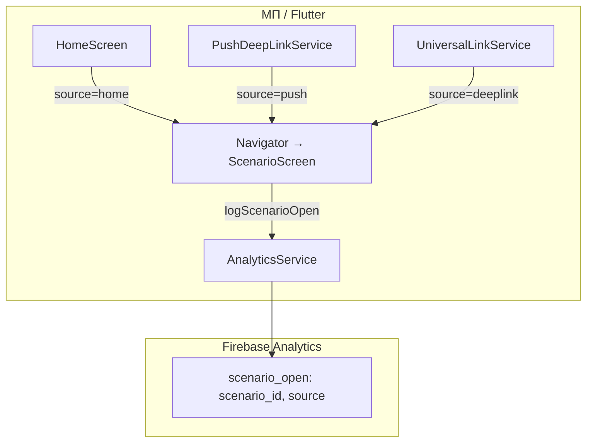

# Спецификация реализации — US-E6-02 «Открытия сценария с разбивкой по source и scenario_id»

## 1. Scope

**В объёме:**

* **Событие открытия сценария** с параметрами `scenario_id` и `source` из согласованного enum (**A-35**, **FR-M-6**).

* **Реестр источников** (`home`, `push`, `deeplink`, `share`) — без произвольных строк (**AC-01**, примечание стори).

* **Прокидывание `source`** через навигацию: витрина (home), push (E3), universal link / share (E5) (**AC-01, AC-02, TC-01/02/04**).

* **Тесты**: unit-тесты enum и сервиса; widget-тест навигации с `source=home` (**TC-01**).

**Вне scope:**

* Источники `group`, `past` — **E7** (не реализованы в релизе).

* `block_view` — **US-E6-03**.

## 2. Требования → шаги

| #  | Требование                                                        | Источник          | Шаги |
| -- | ----------------------------------------------------------------- | ----------------- | ---- |
| R1 | `source` только из реестра, без произвольных строк                 | AC-01, A-35       | 2    |
| R2 | Событие открытия содержит `scenario_id` и `source`                 | AC-01, FR-M-6     | 3    |
| R3 | `source=home` при переходе с витрины                               | AC-01, TC-01      | 4    |
| R4 | `source=push` при переходе из push (E3)                            | AC-02, TC-02      | 4    |
| R5 | `source=deeplink`/`share` при открытии по ссылке (E5)              | TC-04, use-cases §6.2 | 4    |

## 3. Архитектура данных

**Ключевые решения:**

* **Реестр источников** (**A-35**): sealed enum `ScenarioOpenSource` (`home`, `push`, `deeplink`, `share`) в `analytics_events.dart` — компилятор не даст произвольную строку (**TC-03**).

* **Расширение сервиса**: `AnalyticsService.logScenarioOpen(scenarioId, source)` вместо текущего `logScenarioOpen(scenarioId)`.

* **Единая точка навигации**: `_openScenario` в `app.dart` принимает `source` и логирует событие перед `Navigator.push`.

## 4. Шаги (в порядке зависимостей)

### Шаг 1. Реестр источников

* `analytics_events.dart`: sealed enum `ScenarioOpenSource` + константа параметра `source` (уже есть `kParamSource`).

* **Реализовано:** enum `ScenarioOpenSource` (`home`, `push`, `deeplink`, `share`) в `analytics_events.dart`.

### Шаг 2. Расширить сервис

* `AnalyticsService.logScenarioOpen(String scenarioId, ScenarioOpenSource source)` — параметр `source` в `scenario_open`.

* **Реализовано:** `analytics_service.dart` — `logScenarioOpen(scenarioId, source)`.

### Шаг 3. Прокинуть source через навигацию

* `app.dart`: `_openScenario(String scenarioId, ScenarioOpenSource source)` логирует `logScenarioOpen` перед `Navigator.push`.

* `_HomeRoute.onOpenScenario` → `source=home`.

* `_listenDeepLinks` → `source=push`.

* `_listenUniversalLinks` → `source=deeplink`.

* **Реализовано:** `app.dart` — прокидывание `source` через навигацию.

### Шаг 4. Тесты

| AC    | Слой  | Проверка                                             | Где                          |
| ----- | ----- | ---------------------------------------------------- | ---------------------------- |
| AC-01 | unit    | `source` из реестра; `scenario_open` с `scenario_id` и `source` | unit-тест сервиса            |
| AC-01 | widget  | Переход с витрины → `source=home`                    | widget-тест навигации        |
| AC-02 | unit    | `source=push` при deep link                           | unit-тест сервиса            |

* **Реализовано:** `analytics_service_test.dart` — unit-тесты (AC-01, AC-02); `widget_test.dart` — навигация с фейковым логгером.

## 5. Файлы

* `docs/product/specs/e6-scenario-opens-by-source.md` — **настоящий документ** (SP-E6-02).

* `scenario/lib/analytics/analytics_events.dart` — enum `ScenarioOpenSource` (предлагается).

* `scenario/lib/analytics/analytics_service.dart` — `logScenarioOpen(scenarioId, source)` (предлагается).

* `scenario/lib/app.dart` — прокидывание `source` через навигацию (предлагается).

* `scenario/test/analytics_service_test.dart` — unit-тесты (предлагается).

* `scenario/test/widget_test.dart` — widget-тест `source=home` (предлагается).

## 6. Риски

* **Произвольные строки в `source`** — хаос в данных. Митиг: sealed enum (AC-01).

* **Регресс навигации E2/E3/E5** — митиг: widget-тесты навигации.

## 7. Follow-up (вне scope)

* Источники `group`, `past` — **E7**.

* `block_view` — **US-E6-03**.

## 8. Доступы и блокеры

* Firebase Analytics по проекту (уже подключён, **A-34**).

* **A-40**: секреты — только env/Secret Manager, не в git.

## 9. Verify

Соответствие критериям приёмки **US-E6-02**:

* **AC-01 (FR-M-6)** — `scenario_open` с `scenario_id` и `source=home` при переходе с витрины (widget-тест).

* **AC-02** — `source=push` при открытии из push (unit-тест).

Критерий готовности: enum `ScenarioOpenSource`, расширенный сервис и прокидывание `source` реализованы; unit/widget-тесты зелёные.

## 10. История изменений

| Дата       | Автор | Изменение |
| ---------- | ----- | --------- |
| 2026-09-08 | AID   | Первая версия (drafted). Реестр source, расширение сервиса, прокидывание через навигацию. |
| 2026-09-08 | AID   | Реализовано: enum `ScenarioOpenSource`, `logScenarioOpen(scenarioId, source)`, прокидывание source через навигацию; unit/widget-тесты. |