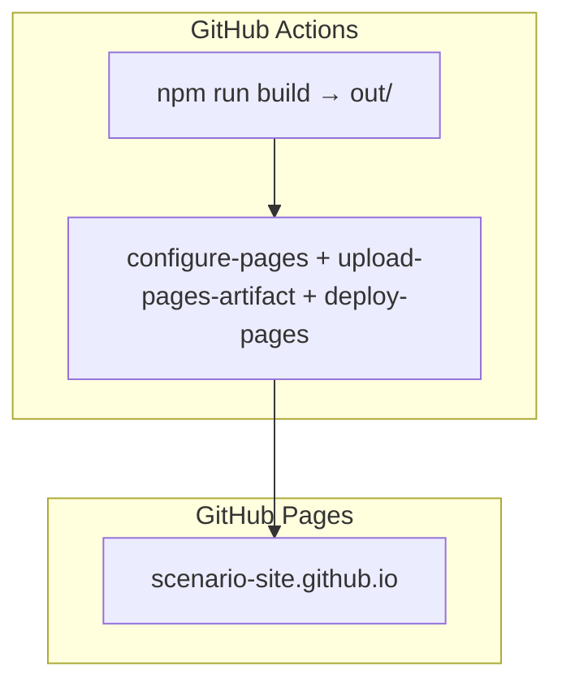

# Спецификация реализации — US-E8-06 «Деплой сайта на GitHub Pages»

## 1. Scope

**В объёме:**

* **Деплой** собранного SSG-сайта (`out/`) на GitHub Pages (**ED-3**, **A-26a**).

* **URL**: `https://<user>.github.io/scenario-site/`.

* **Автоматизация**: шаг деплоя в CI после сборки (**AC-01/02**).

**Вне scope:**

* Сборка SSG — **US-E4-04** (реализована).

* Core Web Vitals — **US-E4-05** (реализована).

* Прод-домен `scenario-games.ru` — отдельная задача (DNS/SSL).

## 2. Требования → шаги

| #  | Требование                                                        | Источник          | Шаги |
| -- | ----------------------------------------------------------------- | ----------------- | ---- |
| R1 | Сайт доступен по URL GitHub Pages после сборки                    | AC-01, ED-3       | 1–2  |
| R2 | Обновление контента → обновление опубликованной версии           | AC-02            | 2    |

## 3. Архитектура данных

**Ключевые решения:**

* **GitHub Pages из Actions**: `actions/configure-pages`, `actions/upload-pages-artifact`, `actions/deploy-pages`.

* **Артефакт**: `out/` (результат `next build` с `output: export`).

* **Триггер**: `workflow_dispatch` (полный rebuild + деплой).

## 4. Шаги (в порядке зависимостей)

### Шаг 1. Пайплайн сборки

* Уже есть: `build.yml` — `npm run build` + Lighthouse.

### Шаг 2. Деплой на GitHub Pages

* Добавить шаги `configure-pages`, `upload-pages-artifact` (path: `out`), `deploy-pages`.

* **Реализовано:** `build.yml` — `permissions: pages`, `configure-pages`, `upload-pages-artifact` (path: `out`), `deploy-pages`.

* **Блокер:** включённый GitHub Pages в настройках репозитория (Source: GitHub Actions).

### Шаг 3. Тесты

| AC    | Слой  | Проверка                                             | Где                          |
| ----- | ----- | ---------------------------------------------------- | ---------------------------- |
| AC-01 | integration | Сайт доступен по URL после деплоя                    | CI (deploy-pages)            |
| AC-02 | integration | Обновление контента → передеплой                    | CI                           |

## 5. Файлы

* `docs/product/specs/e8-deploy-github-pages.md` — **настоящий документ** (SP-E8-06).

* `scenario-site/.github/workflows/build.yml` — шаг деплоя (предлагается).

## 6. Риски

* **GitHub Pages не включён** — блокер. Митиг: включить в настройках репозитория.

* **Путь артефакта** — `out/` должен быть корнем Pages. Митиг: `upload-pages-artifact` с `path: out`.

## 7. Follow-up (вне scope)

* Прод-домен `scenario-games.ru` — DNS/SSL.

## 8. Доступы и блокеры

* **Блокер:** включённый GitHub Pages в настройках репозитория.

* **A-40**: секреты — только env/Secret Manager, не в git.

## 9. Verify

Соответствие критериям приёмки **US-E8-06**:

* **AC-01 (ED-3)** — сайт доступен по URL GitHub Pages (CI).

* **AC-02** — обновление контента → передеплой (CI).

Критерий готовности: шаг деплоя в `build.yml`; сайт публикуется на GitHub Pages.

## 10. История изменений

| Дата       | Автор | Изменение |
| ---------- | ----- | --------- |
| 2026-09-08 | AID   | Первая версия (drafted). Деплой GitHub Pages, шаги configure/upload/deploy. |
| 2026-09-08 | AID   | Реализовано: шаги деплоя в `build.yml` (configure/upload/deploy-pages). Веб-проверка — после включения Pages в настройках репо. |