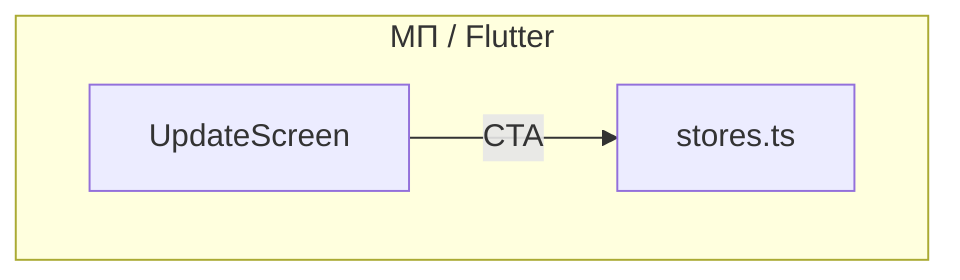

# Спецификация реализации — US-E8-04 «Экран принудительного обновления (политика и CTA)»

## 1. Scope

**В объёме:**

* **Готовый экран «Обновите приложение»** с текстом и CTA в сторы (**A-45**, **ADR-013**).

* **Замена placeholder** из **US-E6-06** (**AC-01**).

* **Ссылки на сторы** (iOS/Android) — из `stores.ts` (US-E8-05).

**Вне scope:**

* Механика проверки совместимости — **US-E6-06** (реализована).

* Реальные id сторов — **US-E8-05**.

## 2. Требования → шаги

| #  | Требование                                                        | Источник          | Шаги |
| -- | ----------------------------------------------------------------- | ----------------- | ---- |
| R1 | Экран с текстом и CTA в сторы                                     | AC-01, A-45       | 1    |
| R2 | Ссылки на сторы из stores.ts                                      | AC-01, US-E8-05   | 2    |

## 3. Архитектура данных

**Ключевые решения:**

* **UpdateScreen**: заголовок, текст, кнопка «Обновить» → ссылка на стор.

* **Ссылки на сторы**: из `stores.ts` (placeholder до US-E8-05).

## 4. Шаги (в порядке зависимостей)

### Шаг 1. Экран

* `update_screen.dart`: заголовок, текст, кнопка «Обновить» с CTA в стор.

* **Реализовано:** `UpdateScreen` — заголовок, текст, кнопка «Обновить» с `UrlLauncher`; маршрут `_UpdateRoute` передаёт launcher.

### Шаг 2. Ссылки на сторы

* Кнопка открывает ссылку на стор (iOS/Android) через `UrlLauncher`.

* **Реализовано (частично):** ссылка на стор через `UrlLauncher`; реальные id — US-E8-05.

### Шаг 3. Тесты

| AC    | Слой  | Проверка                                             | Где                          |
| ----- | ----- | ---------------------------------------------------- | ---------------------------- |
| AC-01 | widget  | Экран показывает текст и CTA                         | widget-тест                  |

## 5. Файлы

* `docs/product/specs/e8-force-update-screen.md` — **настоящий документ** (SP-E8-04).

* `lib/force_update/update_screen.dart` — экран (предлагается).

## 6. Риски

* **Нет id сторов** — митиг: placeholder-ссылки (US-E8-05).

## 7. Follow-up (вне scope)

* Реальные id сторов — **US-E8-05**.

## 8. Доступы и блокеры

* **Блокер:** ссылки на сторы (US-E8-05).

* **A-40**: секреты — только env/Secret Manager, не в git.

## 9. Verify

Соответствие критериям приёмки **US-E8-04**:

* **AC-01 (A-45)** — экран с текстом и CTA в сторы (widget-тест).

Критерий готовности: экран с текстом и CTA реализован.

## 10. История изменений

| Дата       | Автор | Изменение |
| ---------- | ----- | --------- |
| 2026-09-08 | AID   | Первая версия (drafted). Экран с текстом и CTA. |
| 2026-09-08 | AID   | Реализовано: `UpdateScreen` с кнопкой «Обновить» и `UrlLauncher`; widget-тесты. Ссылки на сторы — placeholder до **US-E8-05**. |