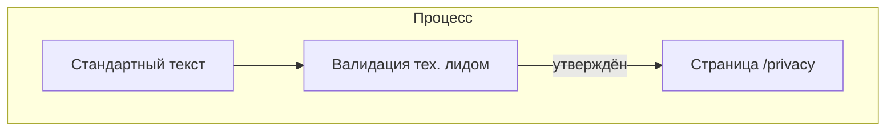

# Спецификация реализации — US-E8-03 «Валидация текста политики конфиденциальности»

## 1. Scope

**В объёме:**

* **Стандартный текст политики** из похожих МП/сайтов (**SR-PRIV-5**, **ED §2**).

* **Валидация тех. лидом** соответствия фактическому составу SDK.

**Вне scope:**

* Реализация страницы — **US-E8-02** (реализована).

* Юридическая экспертиза (если потребуется отдельно).

## 2. Требования → шаги

| #  | Требование                                                        | Источник          | Шаги |
| -- | ----------------------------------------------------------------- | ----------------- | ---- |
| R1 | Текст описывает фактический состав SDK                            | AC-01, SR-PRIV-5  | 1    |
| R2 | Текст доступен по URL                                             | AC-01, ED §2      | 2    |

## 3. Архитектура данных

**Ключевые решения:**

* **Текст**: стандартный из похожих МП/сайтов.

* **Валидация**: тех. лид проверяет соответствие SDK (Firebase, GA4, Supabase, share_plus, app_links).

## 4. Шаги (в порядке зависимостей)

### Шаг 1. Текст

* Взять стандартный текст политики.

* **Блокер:** решение тех. лида.

### Шаг 2. Публикация

* Утверждённый текст на странице `/privacy` (**US-E8-02**).

### Шаг 3. Тесты

| AC    | Слой  | Проверка                                             | Где                          |
| ----- | ----- | ---------------------------------------------------- | ---------------------------- |
| AC-01 | review | Текст описывает фактический состав SDK               | ревью                        |

## 5. Файлы

* `docs/product/specs/e8-privacy-policy-text-validation.md` — **настоящий документ** (SP-E8-03).

* `scenario-site/src/app/privacy/page.tsx` — текст (предлагается).

## 6. Риски

* **Текст не утверждён** — блокер. Митиг: placeholder до решения тех. лида.

## 7. Follow-up (вне scope)

* Юридическая экспертиза.

## 8. Доступы и блокеры

* **Блокер:** решение тех. лида по тексту.

* **A-40**: секреты — только env/Secret Manager, не в git.

## 9. Verify

Соответствие критериям приёмки **US-E8-03**:

* **AC-01 (SR-PRIV-5)** — текст описывает фактический состав SDK (ревью).

Критерий готовности: текст утверждён тех. лидом и опубликован.

## 10. История изменений

| Дата       | Автор | Изменение |
| ---------- | ----- | --------- |
| 2026-09-08 | AID   | Первая версия (drafted). Валидация текста политики. |