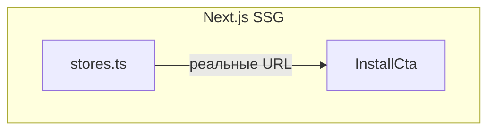

# Спецификация реализации — US-E8-05 «Замена placeholder-ссылок на сторы в CTA»

## 1. Scope

**В объёме:**

* **Реальные ссылки на сторы** (iOS/Android) в CTA установки МП (**FR-W-3**).

* **Замена placeholder** в `stores.ts` (**AC-01**).

**Вне scope:**

* Компонент CTA и его размещение — **US-E4-03** (реализован).

* Экран принудительного обновления — **US-E8-04**.

## 2. Требования → шаги

| #  | Требование                                                        | Источник          | Шаги |
| -- | ----------------------------------------------------------------- | ----------------- | ---- |
| R1 | CTA ведёт на реальную страницу стора                              | AC-01, FR-W-3      | 1    |

## 3. Архитектура данных

**Ключевые решения:**

* **`stores.ts`**: заменить placeholder-URL на реальные id приложений.

## 4. Шаги (в порядке зависимостей)

### Шаг 1. Ссылки на сторы

* `stores.ts`: заменить placeholder-URL на реальные (iOS/Android).

* **Блокер:** идентификаторы приложений в сторах (app id / package name).

### Шаг 2. Тесты

| AC    | Слой  | Проверка                                             | Где                          |
| ----- | ----- | ---------------------------------------------------- | ---------------------------- |
| AC-01 | unit    | CTA ведёт на реальную страницу стора                 | component-тест               |

## 5. Файлы

* `docs/product/specs/e8-store-links.md` — **настоящий документ** (SP-E8-05).

* `scenario-site/src/lib/stores.ts` — ссылки на сторы (предлагается).

## 6. Риски

* **Нет id сторов** — блокер. Митиг: placeholder до публикации приложения.

## 7. Follow-up (вне scope)

* Публикация приложения в сторы.

## 8. Доступы и блокеры

* **Блокер:** идентификаторы приложений в сторах.

* **A-40**: секреты — только env/Secret Manager, не в git.

## 9. Verify

Соответствие критериям приёмки **US-E8-05**:

* **AC-01 (FR-W-3)** — CTA ведёт на реальную страницу стора (component-тест).

Критерий готовности: реальные ссылки на сторы в `stores.ts`.

## 10. История изменений

| Дата       | Автор | Изменение |
| ---------- | ----- | --------- |
| 2026-09-08 | AID   | Первая версия (drafted). Замена placeholder-ссылок на сторы. |