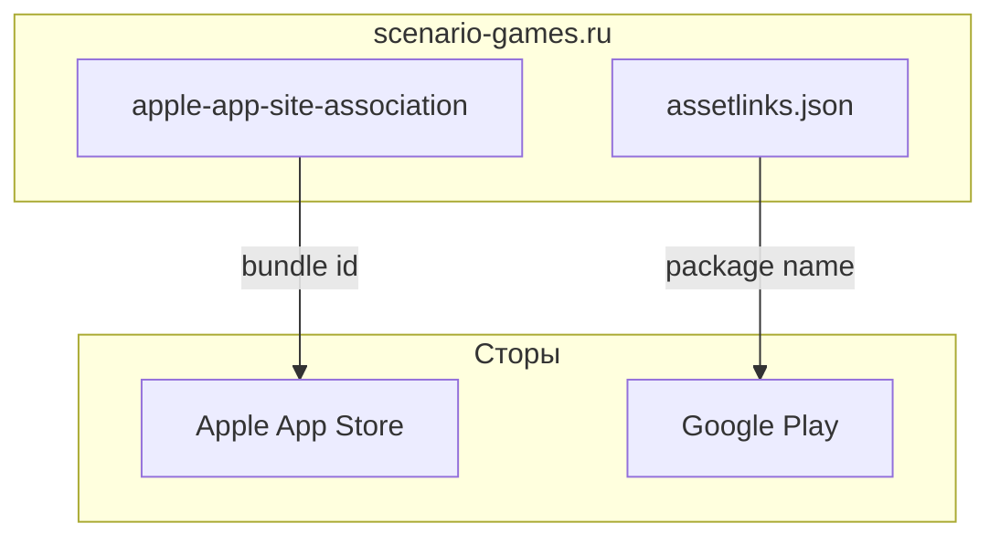

# Спецификация реализации — US-E8-01 «Конфигурация Universal Links на домене»

## 1. Scope

**В объёме:**

* **AASA** (iOS) и **assetlinks.json** (Android) на домене `scenario-games.ru` (**A-24**, **FR-M-7**).

* **Связывание** домена с bundle id / package name приложения.

**Вне scope:**

* Клиентская обработка ссылок — **US-E5-02** (реализована).

* Веб-fallback — **US-E5-03** (реализован).

## 2. Требования → шаги

| #  | Требование                                                        | Источник          | Шаги |
| -- | ----------------------------------------------------------------- | ----------------- | ---- |
| R1 | AASA/assetlinks на домене                                         | AC-01, A-24       | 1    |
| R2 | HTTPS-ссылка открывает приложение                                 | AC-01, FR-M-7     | 2    |

## 3. Архитектура данных

**Ключевые решения:**

* **AASA**: файл на домене с bundle id приложения.

* **assetlinks.json**: файл на домене с package name.

## 4. Шаги (в порядке зависимостей)

### Шаг 1. Файлы на домене

* Разместить AASA и assetlinks.json на `scenario-games.ru`.

* **Блокер:** доступ к DNS/хостингу домена.

### Шаг 2. Проверка ассоциации

* Проверить валидность для стора/устройства.

* **Блокер:** доступ к Apple/Google.

### Шаг 3. Тесты

| AC    | Слой  | Проверка                                             | Где                          |
| ----- | ----- | ---------------------------------------------------- | ---------------------------- |
| AC-01 | e2e   | HTTPS-ссылка открывает приложение                    | устройство                   |
| AC-02 | e2e   | AASA/assetlinks валидны                              | проверка ассоциации          |

## 5. Файлы

* `docs/product/specs/e8-universal-links-domain-config.md` — **настоящий документ** (SP-E8-01).

* `scenario-site/public/apple-app-site-association` — AASA (предлагается).

* `scenario-site/public/.well-known/assetlinks.json` — assetlinks (предлагается).

## 6. Риски

* **Нет доступа к домену/сторам** — блокер. Митиг: согласовать доступы.

## 7. Follow-up (вне scope)

* Клиентская обработка — **US-E5-02** (реализована).

## 8. Доступы и блокеры

* **Блокер:** доступ к DNS домена, Apple App Store, Google Play.

* **A-40**: секреты — только env/Secret Manager, не в git.

## 9. Verify

Соответствие критериям приёмки **US-E8-01**:

* **AC-01 (A-24)** — HTTPS-ссылка открывает приложение (e2e).

* **AC-02** — AASA/assetlinks валидны (e2e).

Критерий готовности: AASA/assetlinks на домене, ассоциация работает.

## 10. История изменений

| Дата       | Автор | Изменение |
| ---------- | ----- | --------- |
| 2026-09-08 | AID   | Первая версия (drafted). AASA/assetlinks на домене. |