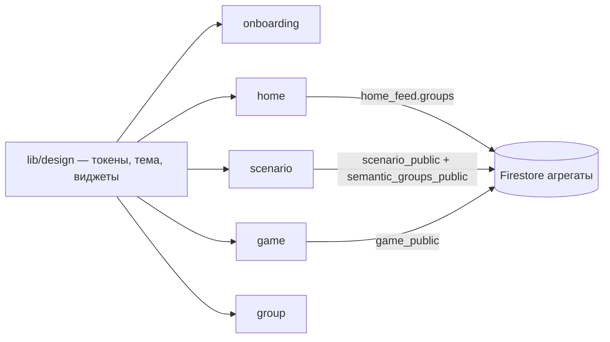

# Спецификация реализации — US-E9-01 «UI-редизайн экранов по Figma-макетам»

## 1. Scope

**В объёме:**

- Дизайн-система `lib/design/`: палитра, типографика (в т.ч. serif-шрифт
  заголовков), тема MaterialApp, подписи enum'ов, общие виджеты (hero-блок,
  капс-заголовок секции, точки-индикаторы, фото-карточки, карточка игры,
  плитка характеристики).
- Онбординг: 3 шага вместо 4 (третий — push с выбором «Разрешить
  уведомления»/«Начать без уведомлений»), тёмная тема, новые тексты,
  точки-индикаторы, «Пропустить» в правом верхнем углу (SP-E3-01/02 —
  функциональность сохраняется).
- Home: брендированная шапка («Scenario» / «Что сегодня?» / «Выберите
  сценарий — получите игру»), витрина горизонтальной лентой крупных
  фото-карточек с подписью «Редакторский выбор», группы смысла —
  горизонтальные ленты (активные и «Сценарии прошлого») (SP-E2-01,
  SP-E7-01/02).
- Сценарий: hero-фото с капс-категорией (заголовок группы смысла, если есть)
  и serif-заголовком, интро (курсивный `subtitle`) + пилюля «Поделиться»,
  капс-блок «Почему эти игры подходят», список игр лавандовыми карточками
  с чипсами характеристик и счётчиком «В ПОДБОРКЕ · N …» (SP-E2-02).
- Игра: hero-карусель во всю ширину с точками и бейджем `caption`,
  serif-заголовок, сетка 2×2 характеристик «КРАТКО», «ОПИСАНИЕ», кнопка
  «Назад» (SP-E2-03).
- Группа смысла: стилизация под дизайн-систему (кремовый фон, компактные
  карточки) без изменения функциональности (SP-E7-01).
- Обновление виджет-тестов под новую вёрстку; все функциональные AC
  E2/E3/E5/E6/E7 сохраняются (AC-02).

**Вне scope:**

- Изменение контракта данных и агрегатов (поля уже достаточны: категории =
  группы смысла из `home_feed.groups`/`semantic_groups_public`, US-E7-01).
- Иллюстрации онбординга (ассетов нет — место зарезервировано, см. Риски).
- Сайт, импорт, аналитика (новые события не вводятся).

## 2. Требования → шаги

| # | Требование | Источник | Шаги |
|---|---|---|---|
| 1 | Тема/палитра/типографика по макетам | docs/figma/design-tokens.md | D1 |
| 2 | Общие виджеты (hero, капс-заголовок, точки, карточки) | docs/figma/screens/* | D2 |
| 3 | Онбординг 3 шага, тёмная тема | docs/figma/screens/onboarding.md | S1 |
| 4 | Home: шапка, витрина-лента, группы-секции | docs/figma/screens/home.md | S2 |
| 5 | Сценарий: hero+категория, чипсы, счётчик | docs/figma/screens/scenario.md | S3 |
| 6 | Игра: hero-карусель, 2×2, caption-бейдж | docs/figma/screens/game.md | S4 |
| 7 | Сохранить block_view, аналитику, share, офлайн | US-E6-03, US-E5-01, AC-02 | S3/S4 |
| 8 | Тесты зелёные | AC-02 | T1 |

## 3. Архитектура данных

Изменений нет. Используются существующие поля:

- `HomeFeed.groups: List<GroupRef>` (title → капс-категории/заголовки секций,
  isPastArchive → «Сценарии прошлого»).
- `ScenarioPublic.semanticGroupIds` → заголовок первой группы
  (`getSemanticGroup(id).title`) — капс-категория в hero сценария; нет —
  метка не показывается.
- `ScenarioGameRef.playersHint/durationBucket/ageHint/rulesComplexity` →
  чипсы; `GamePublic.*` → сетка 2×2; `Slide.caption` → бейдж на фото.

**Ключевые решения:**

- Токены — приближения по скриншотам (`docs/figma/design-tokens.md`),
  собраны в одном модуле `AppColors`/`AppTypography` для точной замены
  после Dev Mode-ревизии.
- Serif-шрифт заголовков — Playfair Display (OFL), бандлится в приложение;
  при отсутствии сети у агента — системный serif (`fontFamilyFallback`),
  константа в одном месте.
- Подписи enum'ов (`DurationBucket`/`RulesComplexity`) переносятся из
  `game_screen.dart` в `lib/design/labels.dart` и приводятся к формулировкам
  макета («Короткая партия», «Быстро объяснить»).
- Витрина не несёт капс-категории (в `ScenarioCard` нет категории; группы —
  отдельные ленты). Подпись «Редакторский выбор» — константа UI.
- Секции home рендерят `GroupRef`-карточки без догрузки содержимого групп
  (без N+1 чтений; состав группы — на экране группы, как в SP-E7-01).

## 4. Шаги (в порядке зависимостей)

- **D1** `lib/design/`: `app_colors.dart`, `app_typography.dart`
  (+ шрифт в `assets/fonts/` и pubspec при удачной загрузке), `app_theme.dart`
  (ThemeData: кремовый scaffold, фиолетовый primary, терракотовый secondary),
  `labels.dart` (подписи enum'ов + склонение «игра/игры/игр»).
- **D2** `lib/design/widgets.dart`: `HeroBlock` (фото + затемнение + слоты
  caps/title/back/child), `CapsHeader`, `DotsIndicator`, `ScenarioPhotoCard`
  (large/compact), `GameListCard` (лавандовая карточка с чипсами),
  `CharacteristicTile`, `PillButton`.
- **S1** `onboarding_screen.dart`: список из 2 value-шагов + push-шаг
  (askPush), тёмный Scaffold, точки, «Пропустить» сверху, новые тексты.
  Поведение: `onCompleted` на любом выходе, `onAllowPush` при «Разрешить
  уведомления» (без изменений).
- **S2** `home_screen.dart`: шапка-брендблок, витрина
  (`SizedBox(height~420)` + горизонтальный `ListView` из `ScenarioPhotoCard`),
  ленты активных групп и «Сценарии прошлого», состояния загрузки/ошибки/
  офлайн/пусто — сохранены; колбэки без изменений.
- **S3** `scenario_screen.dart`: hero (`imageRef` + caps-категория через
  `getSemanticGroup`), интро + «Поделиться» (`onShare`), `BlockViewReporter`
  (kBlockScenarioWhy, kBlockScenarioGames — те же blockId), счётчик со
  склонением, карточки `GameListCard` → `onOpenGame`.
- **S4** `game_screen.dart`: hero-карусель `PageView` во всю ширину,
  точки + бейдж `caption ?? alt`, стрелка назад (`Navigator.pop`), «КРАТКО»
  2×2 `CharacteristicTile` (kBlockGameCarousel, kBlockGameCharacteristics),
  «ОПИСАНИЕ» = контекстный `shortDescription` (ED-9), кнопка «Назад».
- **S5** `group_screen.dart`: кремовый фон, капс-заголовок, компактные
  карточки; функциональность без изменений.
- **S6** `app.dart`: MaterialApp получает `theme: AppTheme.light()`.
- **T1** Обновить тесты: `onboarding_screen_test`, `home_screen_test`,
  `scenario_screen_test`, `game_screen_test`, `group_screen_test`,
  `widget_test.dart`. Прогнать `flutter test`, валидаторы не затрагиваются.

## 5. Файлы

**Новые:** `lib/design/app_colors.dart`, `lib/design/app_typography.dart`,
`lib/design/app_theme.dart`, `lib/design/labels.dart`,
`lib/design/widgets.dart`, `assets/fonts/*` (шрифт, при удачной загрузке),
`docs/product/specs/e9-ui-redesign.md`.

**Изменяемые:** `lib/features/onboarding/onboarding_screen.dart`,
`lib/features/home/home_screen.dart`, `lib/features/scenario/scenario_screen.dart`,
`lib/features/game/game_screen.dart`, `lib/features/group/group_screen.dart`,
`lib/app.dart`, `pubspec.yaml`,
тесты: `test/onboarding_screen_test.dart`, `test/home_screen_test.dart`,
`test/scenario_screen_test.dart`, `test/game_screen_test.dart`,
`test/group_screen_test.dart`, `test/widget_test.dart`.

## 6. Риски

| Риск | Митигация |
|---|---|
| Точные токены неизвестны (Dev Mode недоступен) | Значения из design-tokens.md в одном модуле; замена — правка констант |
| Иллюстрации онбординга не экспортированы (нет авторизации в Figma) | Верхняя половина шагов — зарезервированная область на тёмном фоне; ассет-слот добавляется без изменения логики |
| Смена вёрстки ломает block_view-оценки (topOffset/height) | Пересчитать offsets; blockId не менять; ручной смоук трекинга |
| Шрифт: бандл может не получиться (сеть/лицензия) | Fallback — системный serif через константу `AppTypography.displayFontFamily` |
| Тесты завязаны на ListTile/старые тексты | Обновляются в T1; функциональные проверки (колбэки, состояния) сохраняются |

## 7. Follow-up (вне scope)

- Точная ревизия токенов из Figma Dev Mode, экспорт иллюстраций онбординга.
- Догрузка карточек внутри групп прямо на home (если потребуется) — отдельно.
- «Назад» на экране игры: сейчас `Navigator.pop`; при решении дизайнера
  «К сценарию» — отдельная правка.

## 8. Доступы и блокеры

- Доступ к Figma Dev Mode не требуется для этой итерации (токены —
  приближения; зафиксировано как открытый вопрос стори).
- Секреты не затрагиваются (A-40).

## 9. Verify

- **AC-01** — экраны соответствуют макетам: тема (тёмный онбординг, кремовый
  контент, терракота, serif-заголовки), hero-блоки, витрина-лента, чипсы,
  2×2, точки-индикаторы — по скриншотам docs/figma/images/ (визуальная
  сверка; автоматизируется на уровне виджет-тестов по ключевым элементам).
- **AC-02** — `flutter test` зелёный полностью; обновлённые тесты сохраняют
  функциональные проверки: онбординг (завершение, подписка, skip), home
  (порядок витрины/групп, офлайн), сценарий (порядок игр, переносы строк,
  офлайн), игра (карусель, характеристики, контекстное описание, офлайн),
  group, навигация app.

## 10. История изменений

| Дата | Автор | Изменение |
|---|---|---|
| 2026-09-09 | ZCode | Черновик по стори US-E9-01 и docs/figma |
| 2026-09-11 | ZCode | Реализовано (D1–S6, T1): дизайн-система `lib/design/` (AppColors/AppTypography/AppTheme/labels/widgets, Playfair Display в `assets/fonts/`), экраны onboarding/home/scenario/game/group, тема в `app.dart`; hero-фото сценария берётся из `home_feed`/`semantic_groups_public` внутри экрана (без изменения колбэков навигации). Тесты: `flutter test` 78/78 зелёные, `flutter analyze` без замечаний; обновлены `onboarding/home/scenario/game/group/widget` тесты. Статус → approved. |
